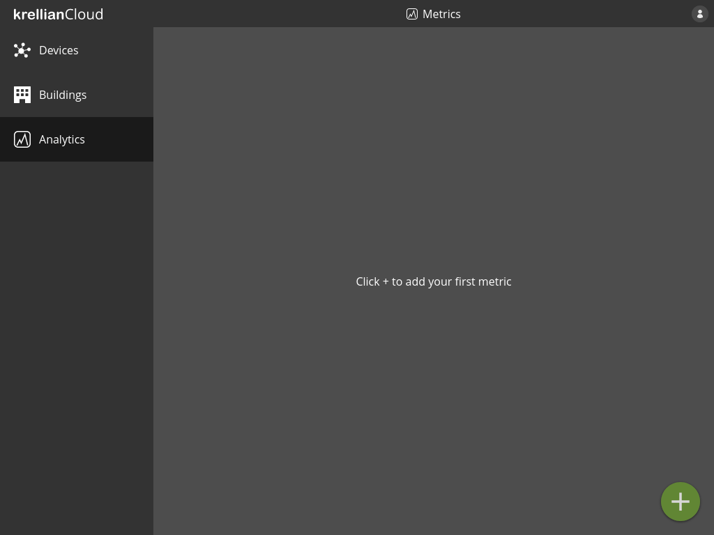
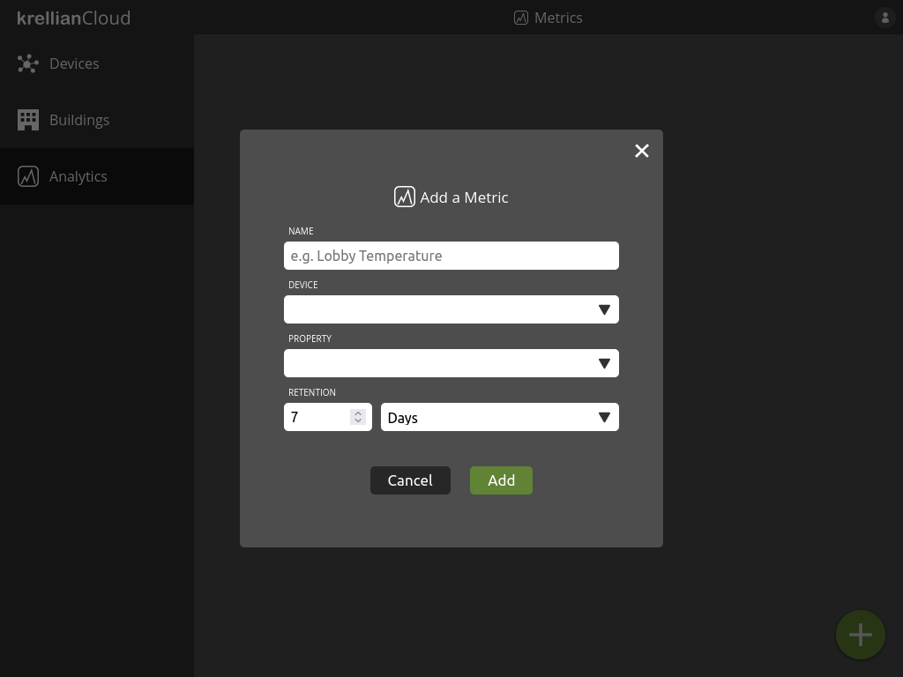
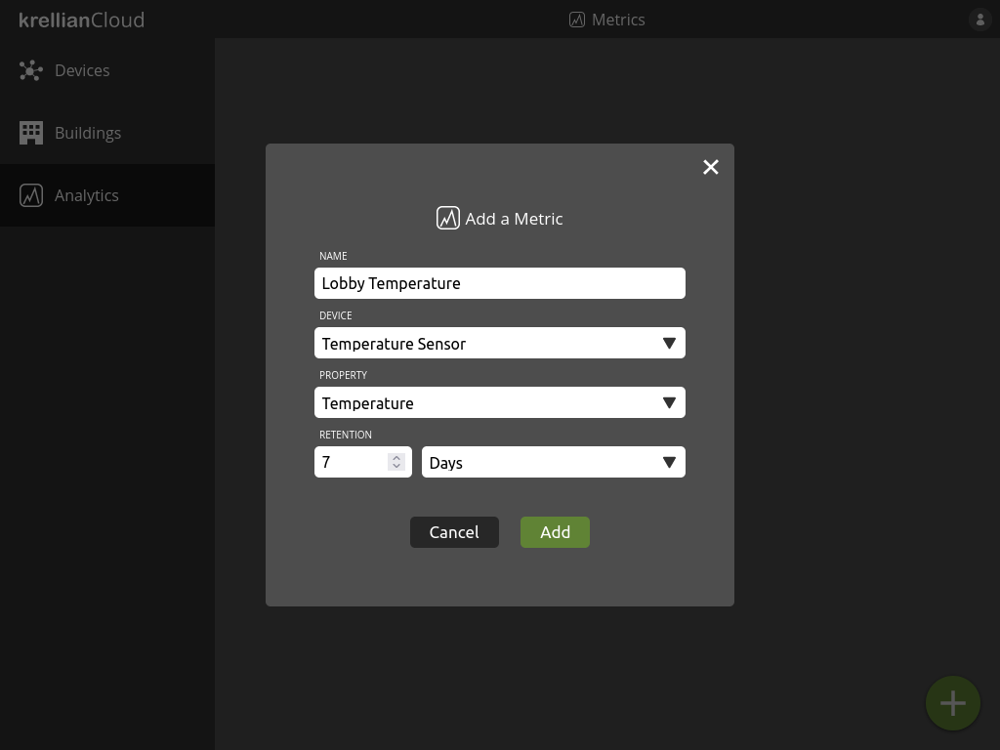
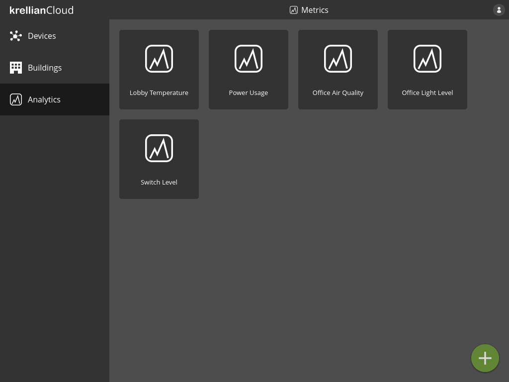
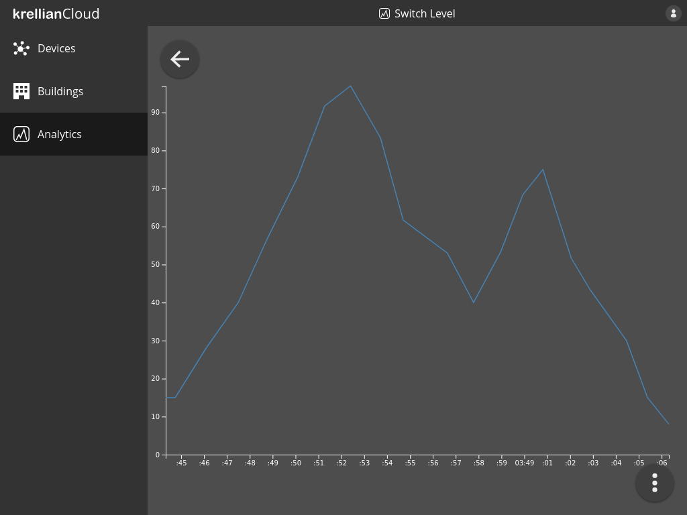
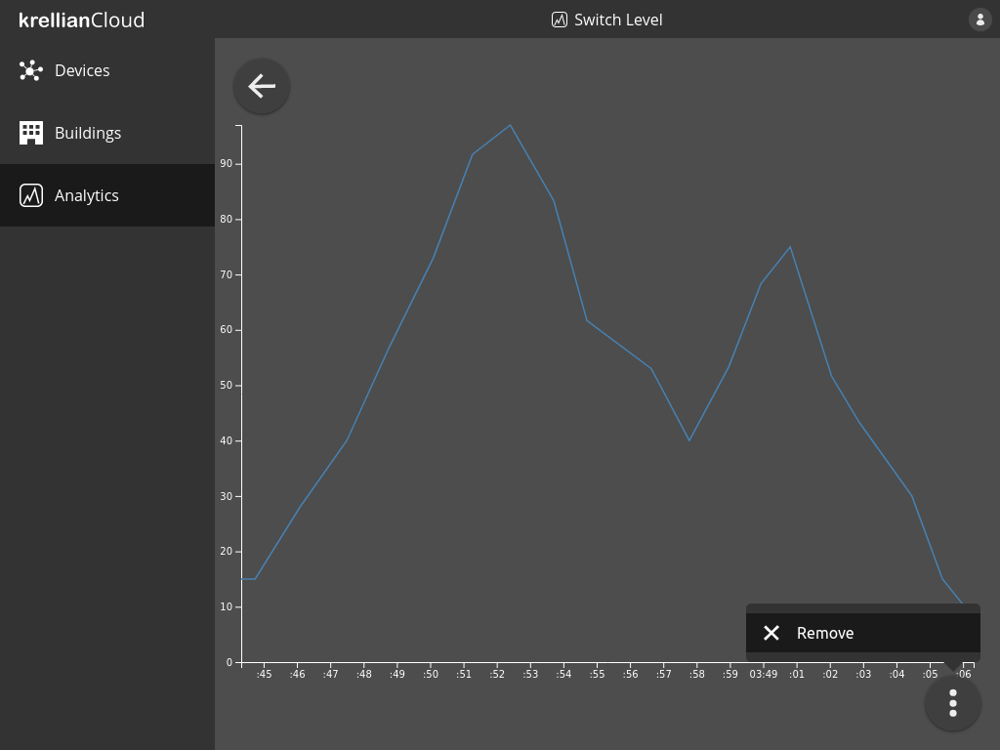
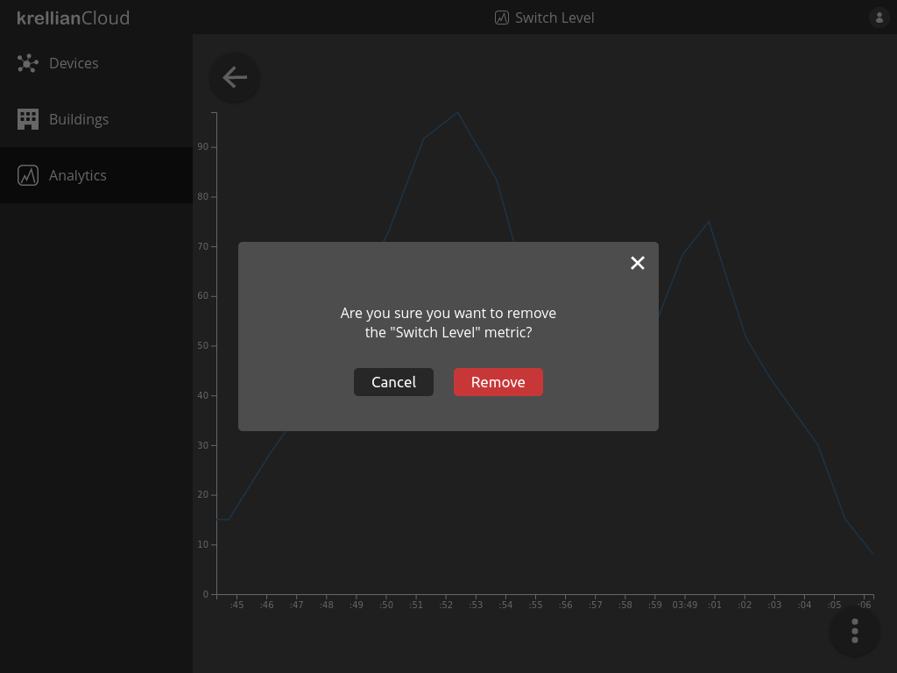

# Analytics

## Add Metric

Metrics provide the ability to log and visualise the value of a particular property of a particular device over time.

To add a metric:

1. Navigate to the "Analytics" view in the main menu
2. Click the "+" button at the bottom right of the screen
3. Enter a name for the metric, e.g. "Lobby Temperature"
4. Select the device to which the property of interest belongs
5. Select the property of the device to log
6. Enter the retention period (the period of time for which saved values are retained)
7. Click the "Add" button

*Empty metrics view*

*Add metric dialog*

*Populated add metric dialog*

> **_Technical Note:_** Metrics currently only support numerical properties (i.e. those with a `type` of `number` or `integer`). Properties can only be logged if they provide an `observeproperty` operation conforming to the [HTTP SSE Profile](https://w3c.github.io/wot-profile/#sec-http-sse-profile).

## List Metrics

To view a list of metrics:

1. Navigate to the "Analytics" view in the main menu

The user is shown a list of metrics they are tracking.

*Analytics view*

## View Metric

To view the results of a metric:

1. Navigate to the "Analytics" view in the main menu
2. Click on the metric you would like to view

The user will be shown a line graph of the value of the property over time.

*Metric view*

> **_Note:_** Currently the graph shows all known values of the property over time and the graph can not yet be zoomed or filtered.

## Remove Metric

To remove a metric:

1. Navigate to the metric in the analytics view
2. Click the overflow menu button at the bottom right of the screen
3. Click the "Remove" menu option
4. Click the "Remove" button in the confirmation dialog

> **_Note:_** When a metric is removed, previously logged property readings relating to the metric are not immediately deleted since other metrics may rely on them. Logged readings are automatically deleted once their retention period expires.

*Remove metric option in metric overflow menu*

*Remove metric confirmation dialog*