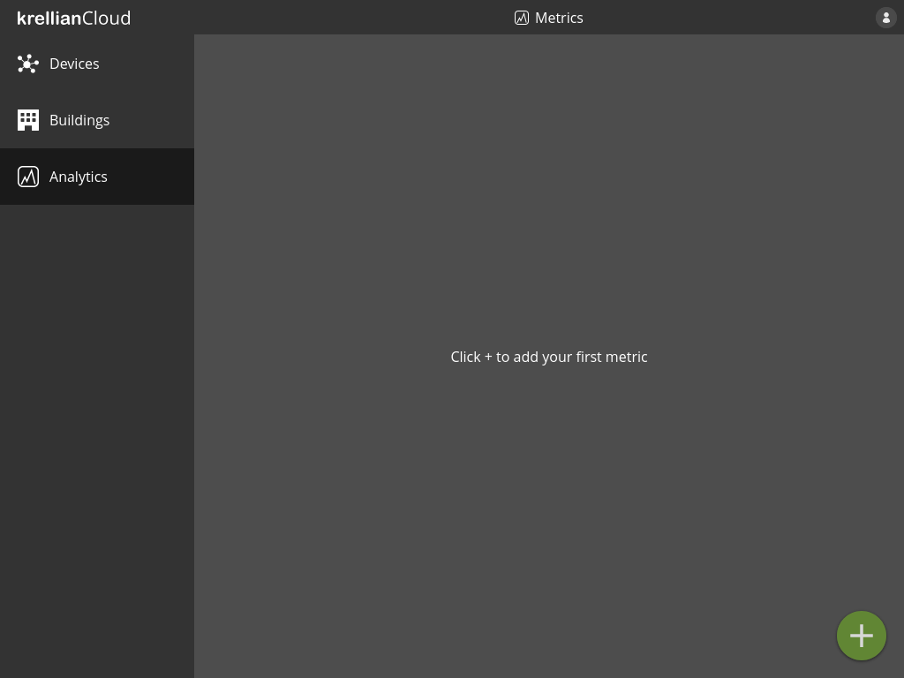
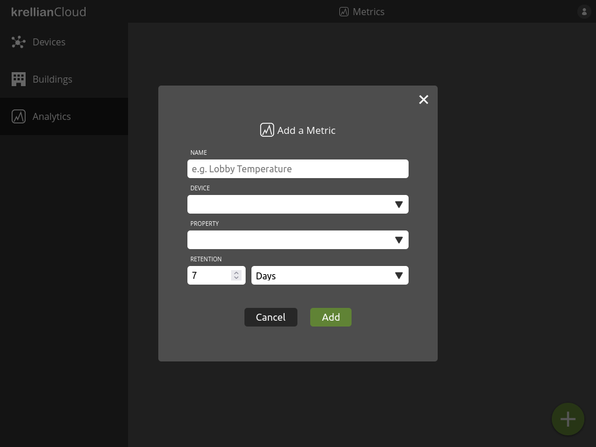
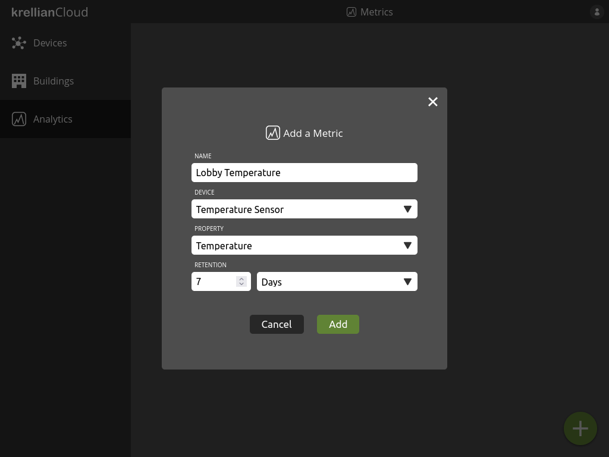

# Add Metric

Metrics provide the ability to log and visualise the value of a particular property of a particular device over time.

To add a metric:

1. Navigate to the "Analytics" view in the main menu
2. Click the "+" button at the bottom right of the screen
3. Enter a name for the metric, e.g. "Lobby Temperature"
4. Select the device to which the property of interest belongs
5. Select the property of the device to log
6. Enter the retention period (the period of time for which saved values are retained)
7. Click the "Add" button

*Empty metrics view*

*Add metric dialog*

*Populated add metric dialog*

> **_Technical Note:_** Metrics currently only support numerical properties (i.e. those with a `type` of `number` or `integer`). Properties can only be logged if they provide an `observeproperty` operation conforming to the [HTTP SSE Profile](https://w3c.github.io/wot-profile/#sec-http-sse-profile).