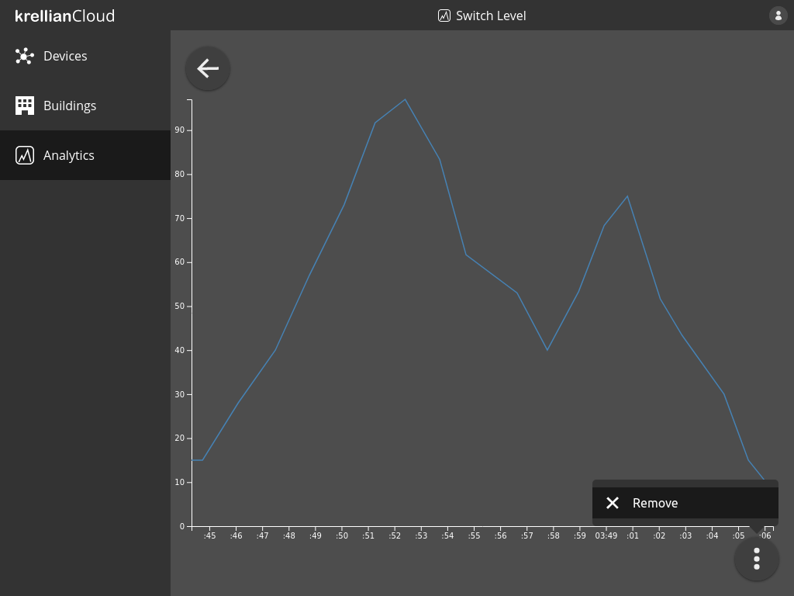
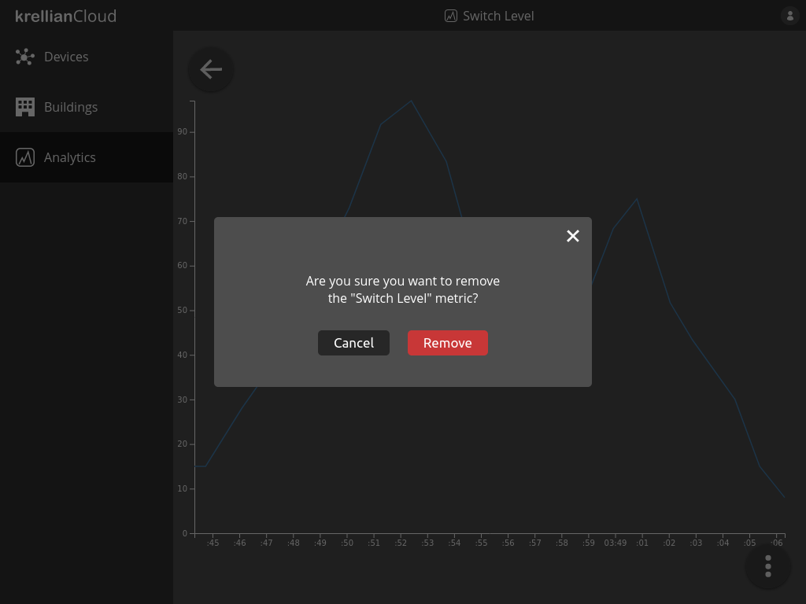

# Remove Metric

To remove a metric:

1. Navigate to the metric in the analytics view
2. Click the overflow menu button at the bottom right of the screen
3. Click the "Remove" menu option
4. Click the "Remove" button in the confirmation dialog

> **_Note:_** When a metric is removed, previously logged property readings relating to the metric are not immediately deleted since other metrics may rely on them. Logged readings are automatically deleted once their retention period expires.

*Remove metric option in metric overflow menu*

*Remove metric confirmation dialog*