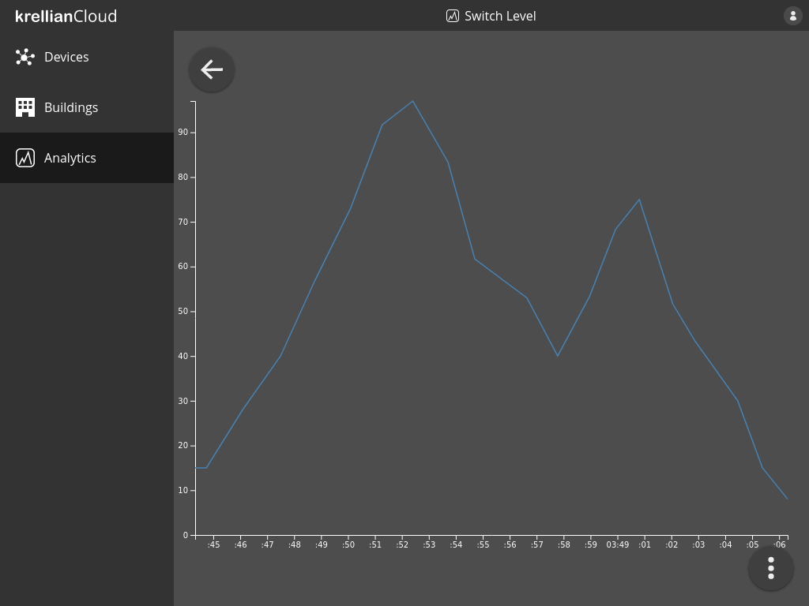

# View Metric

To view the results of a metric:

1. Navigate to the "Analytics" view in the main menu
2. Click on the metric you would like to view

The user will be shown a line graph of the value of the property over time.

*Metric view*

> **_Note:_** Currently the graph shows all known values of the property over time and the graph can not yet be zoomed or filtered.