# Buildings

## Add Building

Devices can be added to a building, which can have one or more floors, with a floorplan for each floor. Devices can then be arranged on the floorplans to represent their physical location.

To add a building to the buildings view:

1. Navigate to the "Buildings" view in the main menu
2. Click the "+" button at the bottom right of the screen
3. Enter the name of the building
4. Click the "+" button to add more floors
5. Enter a floor short code (e.g. "GF" or "1") and floor name (e.g. "Ground Floor" or "First Floor") for each floor of the building
6. Click the "Add" button to add the building

> **_Note:_** The highest floor should appear at the top of the list and the lowest floor should appear at the bottom of the list.

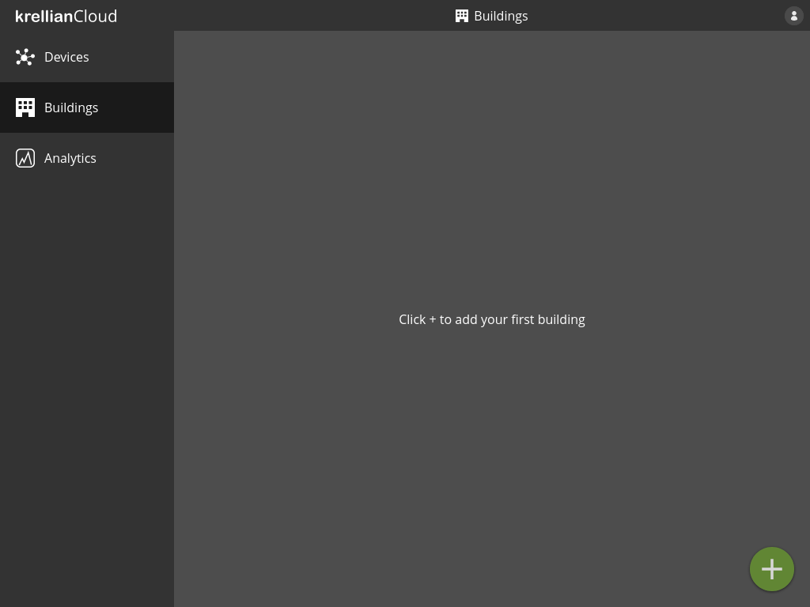
*Empty buildings view*

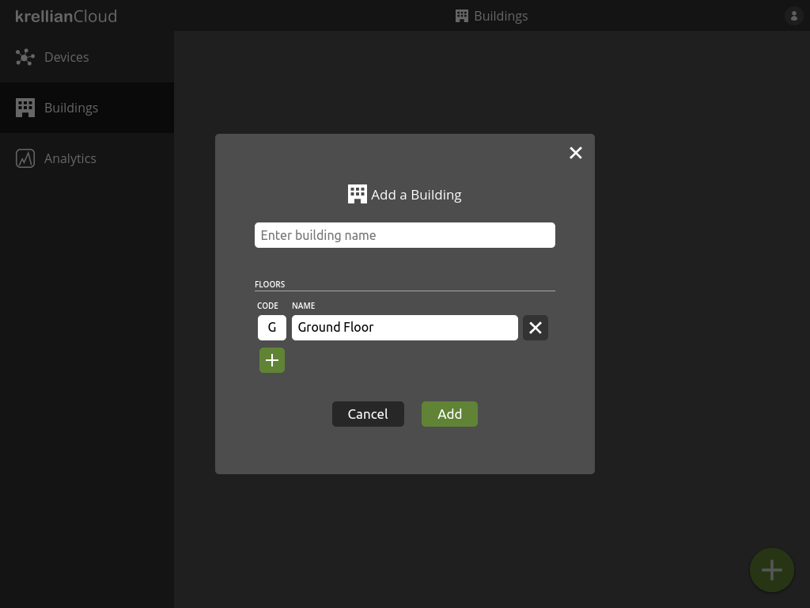
*Add building dialog*

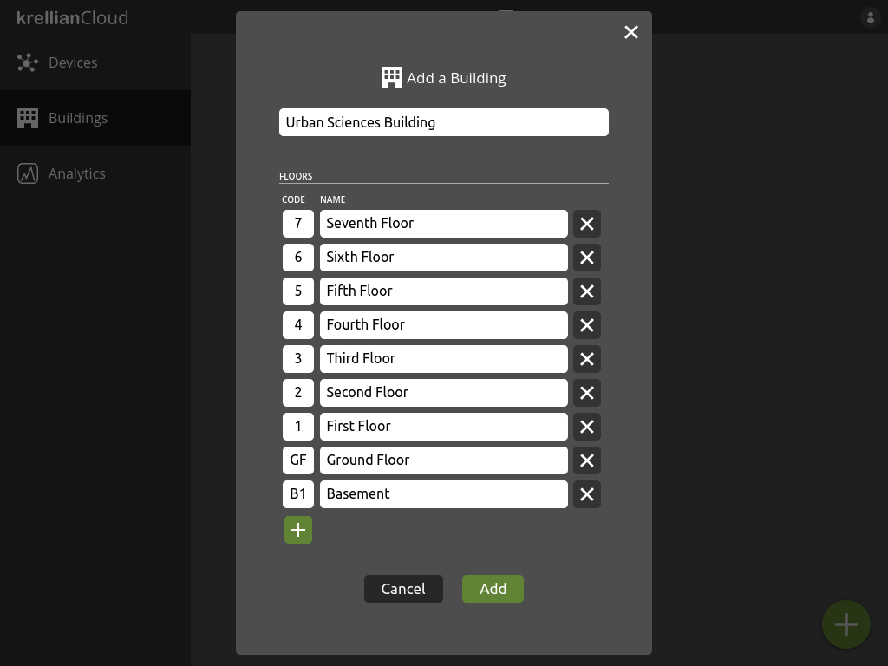
*Populated add building dialog*

## List Buildings

To view a list of buildings:

1. Navigate to the "Buildings" view in the main menu

The user is shown a list of buildings they have added.

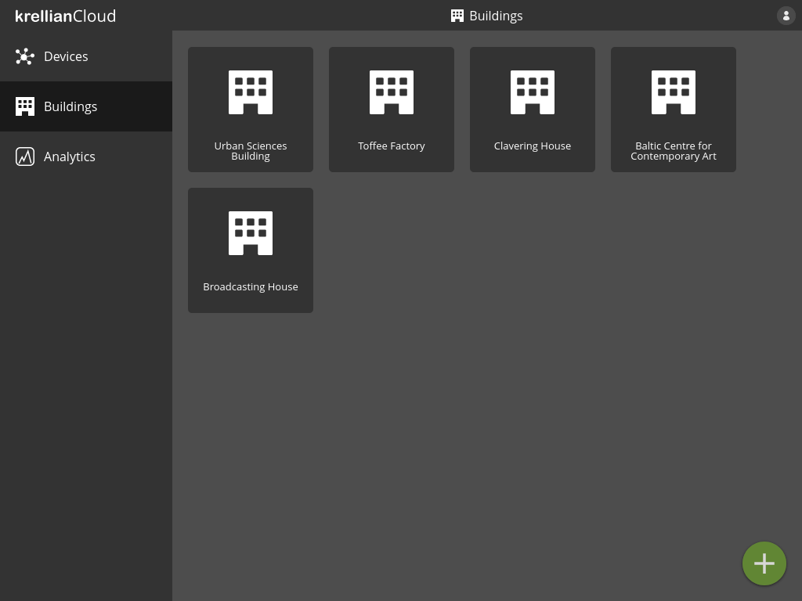
*Buildings view*

## View Building

To view the details of a particular building:

1. Navigate to the "Buildings" view in the main menu
2. Click on the building you would like to view

To switch between floors the user can click the floor code on the floor switcher on the right hand side of the screen.

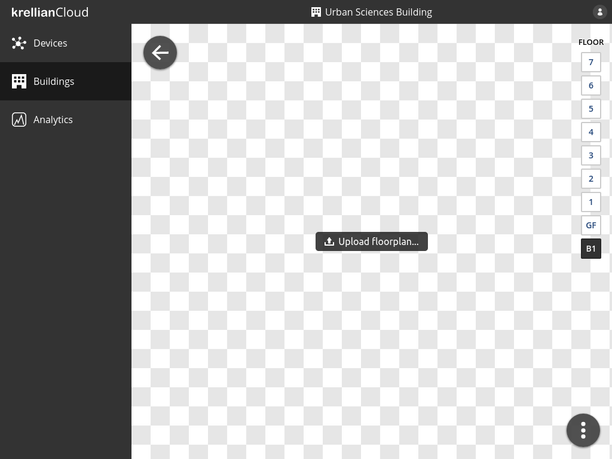
*Building view*

## Upload Floorplan

To upload a floorplan of a floor of a building:

1. Navigate to the detail view of the building from the buildings view
2. Navigate to the floor for which you would like to upload a floorplan using the floor switcher on the right hand side of the screen
3. Click the "Upload floorplan" button
4. Select an image file to upload

Once a floorplan is uploadedn successfully the user can pan and zoom around the floorplan using a mouse or touch gestures, or zoom by pressing the zoom in and out buttons at the bottom left of the floorplan.

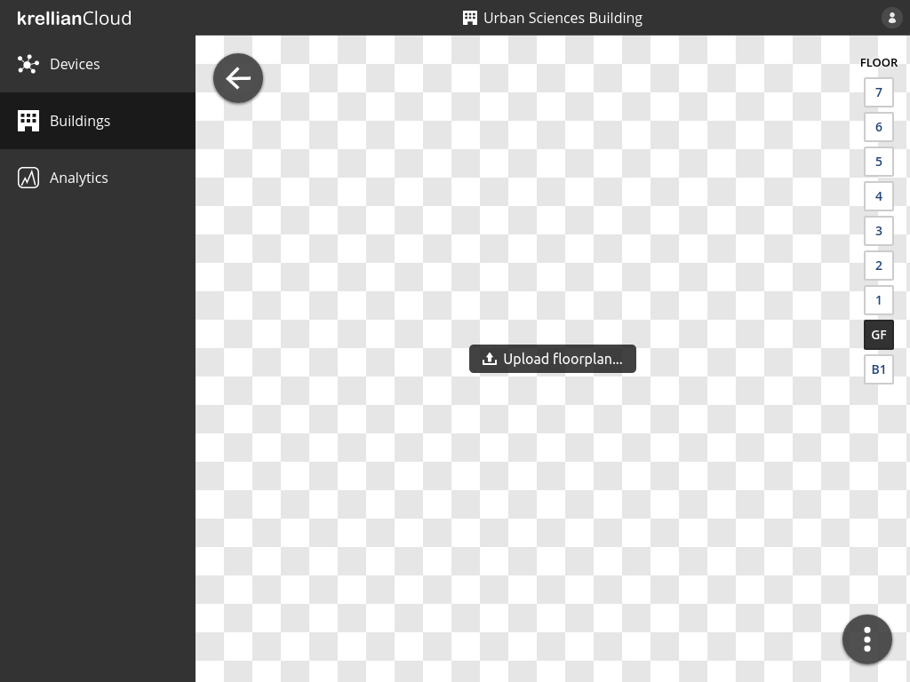
*Upload floorplan button*

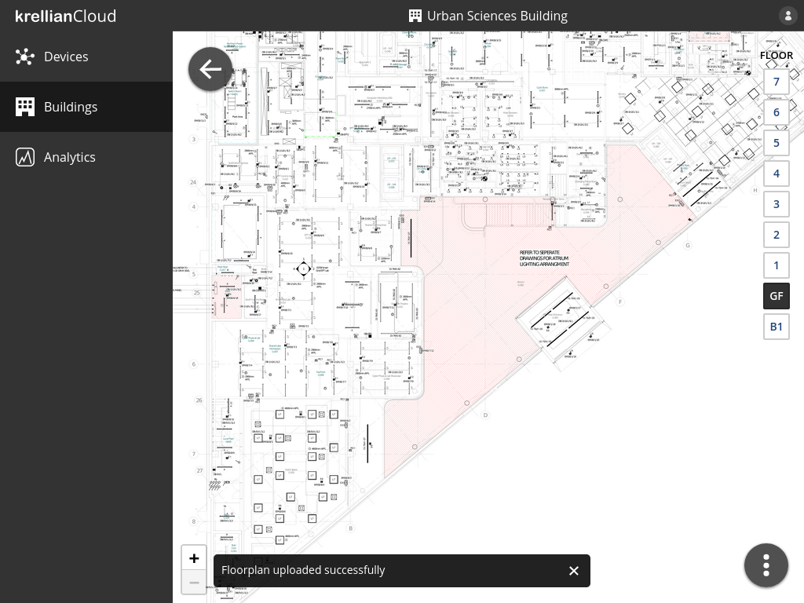
*Floorplan uploaded confirmation*

## Add Device to Floor

To add a device to a floor of a building:

1. Navigate to the building via the buildings view
2. Select the floor to which the device is to be added using the floor selector on the right hand side of the screen
3. Click the overflow menu button at the bottom right of the screen
4. Click the "Add device" menu option
5. Select the name of the device in the "Add Device to Floor" dialog
6. Click the "Add" button

The newly added device will appear as a blue pin at the centre of the floorplan. Hovering over the pin will show the name of the device.

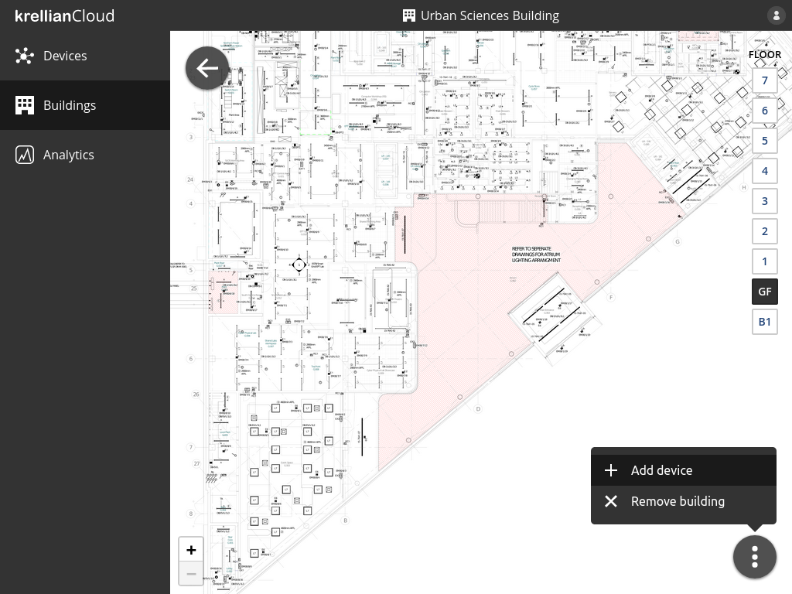
*Floor overflow menu*

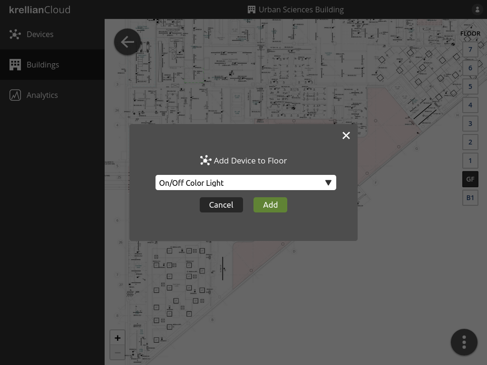
*Add Device to Floor dialog*

*Device added to floor confirmation*

## Position Devices on Floor

To position devices on a floorplan:

1. Click or tap and hold a blue pin
2. Drag the pin to the desired location
3. Release the pin

*Devices arranged on a floorplan*

## Remove Building

To remove a building:

1. Navigate to the building in the buildings view
2. Click the overflow menu button at the bottom right of the screen
3. Click the "Remove building" menu option
4. Click the "Remove" button in the confirmation dialog

When a building is removed, all of the associated floorplans and device positions are deleted. The devices are *not* removed from the devices dashboard.

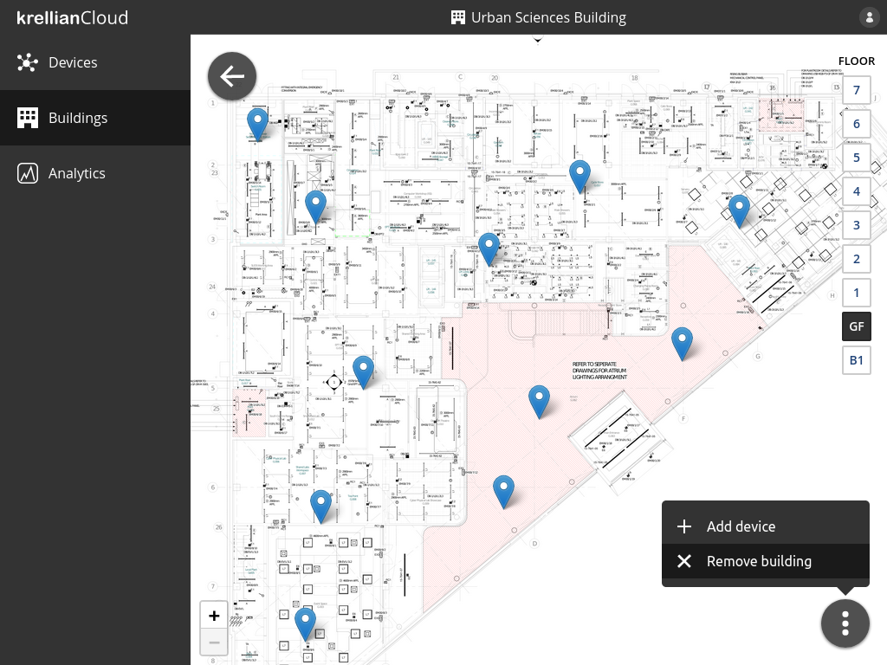
*Remove building option in floor overflow menu*

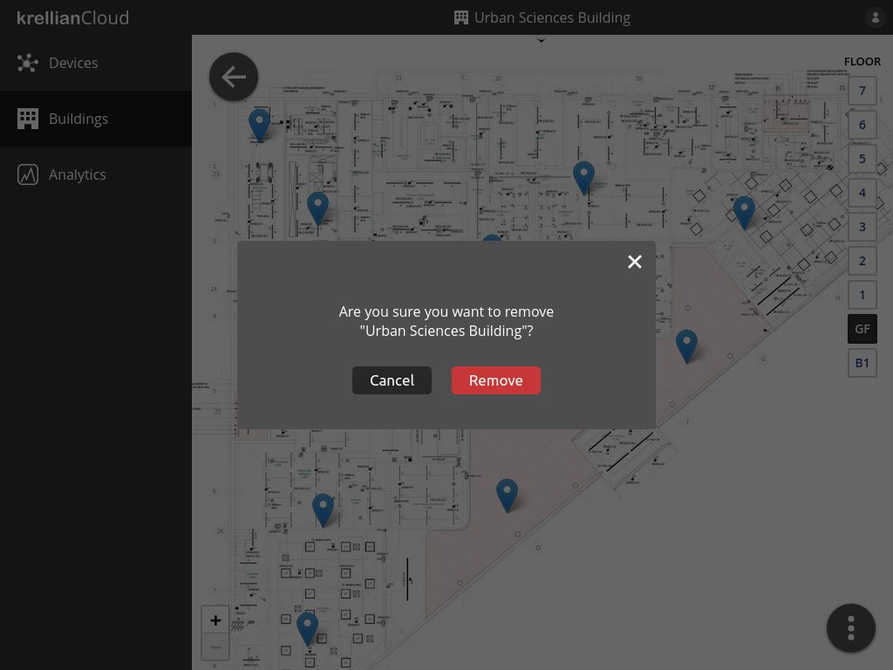
*Remove building confirmation dialog*