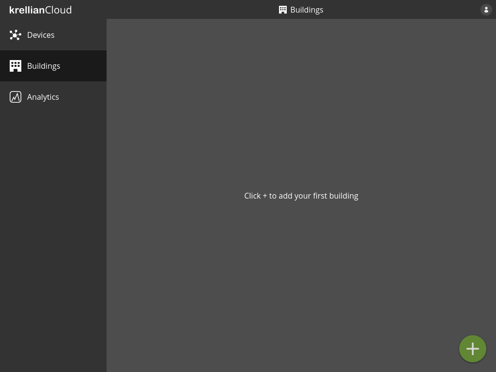
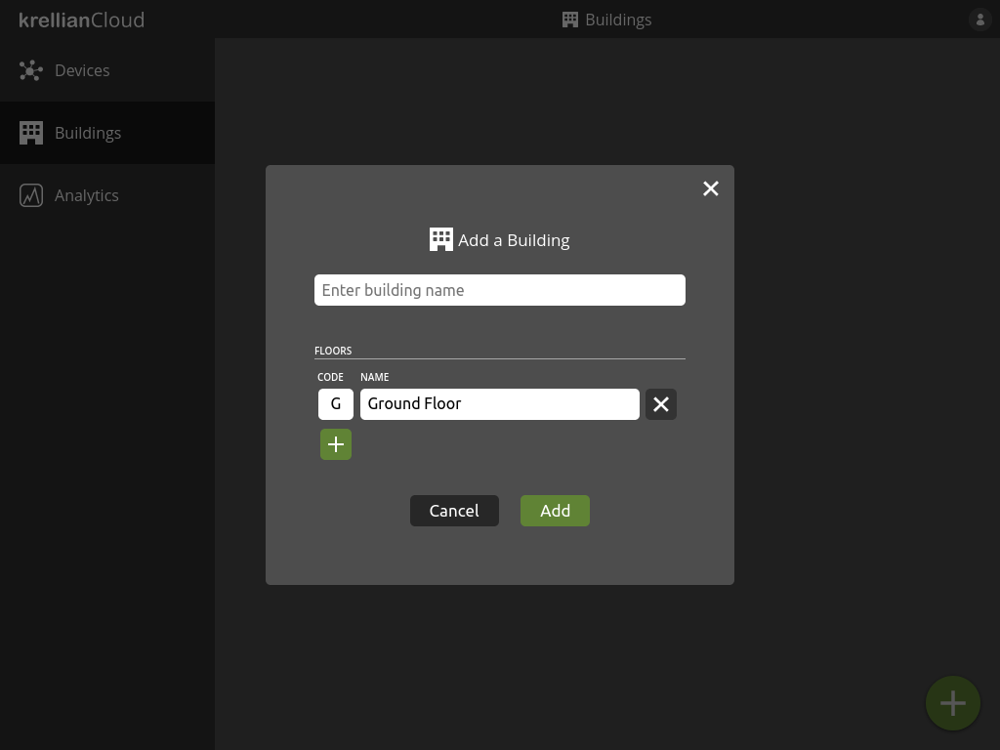
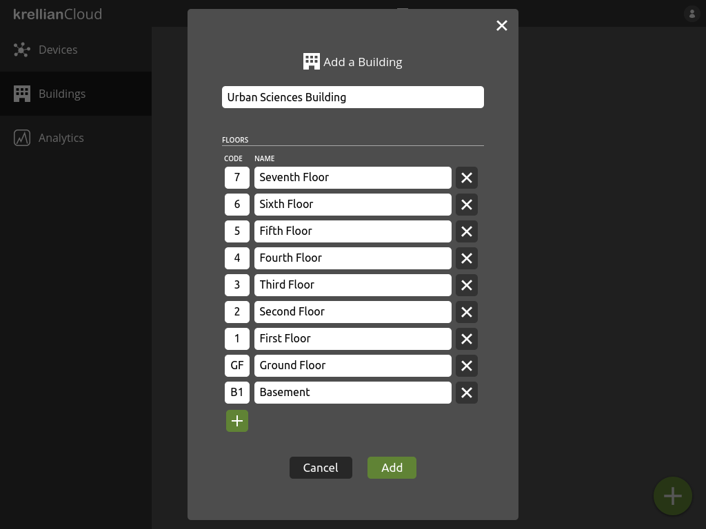

# Add Building

Devices can be added to a building, which can have one or more floors, with a floorplan for each floor. Devices can then be arranged on the floorplans to represent their physical location.

To add a building to the buildings view:

1. Navigate to the "Buildings" view in the main menu
2. Click the "+" button at the bottom right of the screen
3. Enter the name of the building
4. Click the "+" button to add more floors
5. Enter a floor short code (e.g. "GF" or "1") and floor name (e.g. "Ground Floor" or "First Floor") for each floor of the building
6. Click the "Add" button to add the building

> **_Note:_** The highest floor should appear at the top of the list and the lowest floor should appear at the bottom of the list.

*Empty buildings view*

*Add building dialog*

*Populated add building dialog*