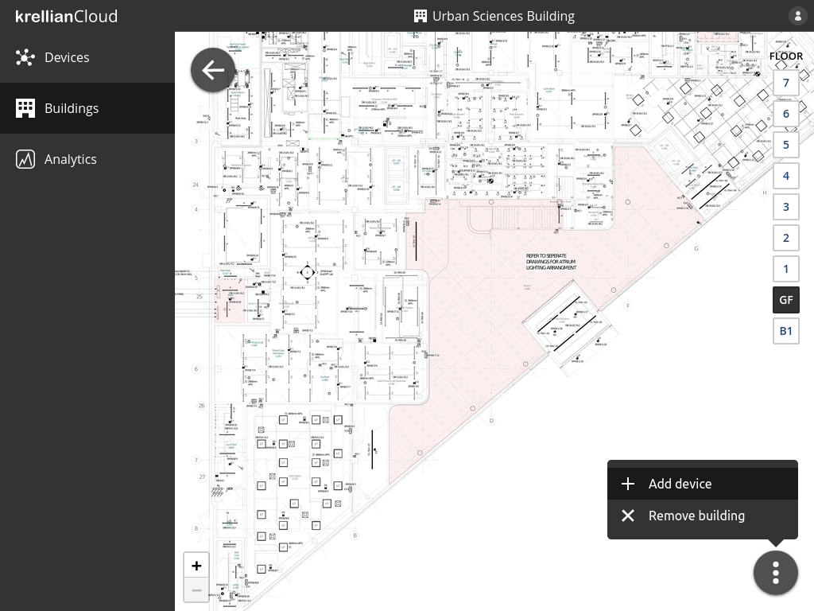
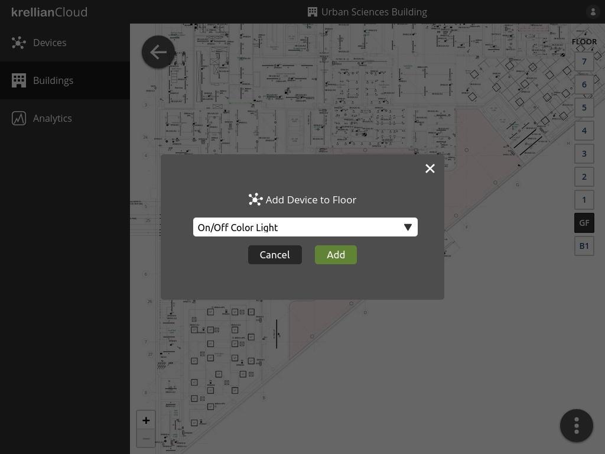
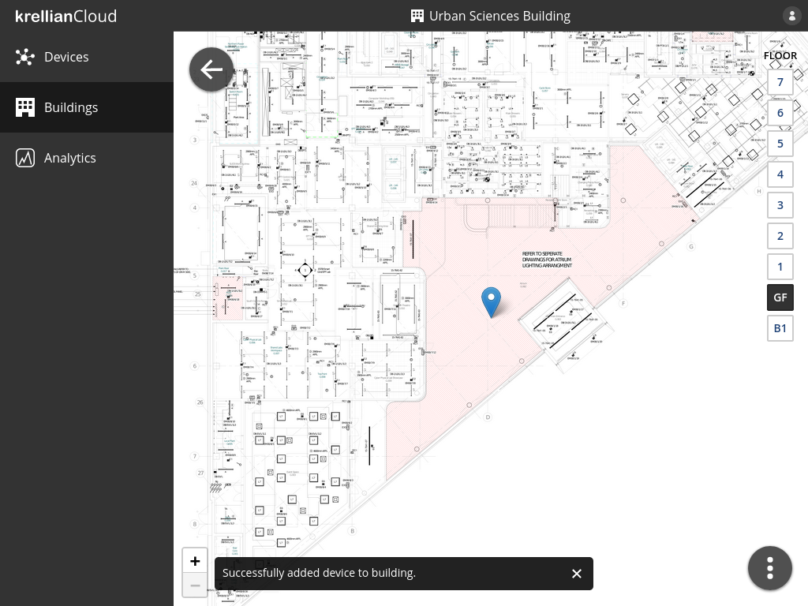

# Add Device to Floor

To add a device to a floor of a building:

1. Navigate to the building via the buildings view
2. Select the floor to which the device is to be added using the floor selector on the right hand side of the screen
3. Click the overflow menu button at the bottom right of the screen
4. Click the "Add device" menu option
5. Select the name of the device in the "Add Device to Floor" dialog
6. Click the "Add" button

The newly added device will appear as a blue pin at the centre of the floorplan. Hovering over the pin will show the name of the device.

*Floor overflow menu*

*Add Device to Floor dialog*

*Device added to floor confirmation*