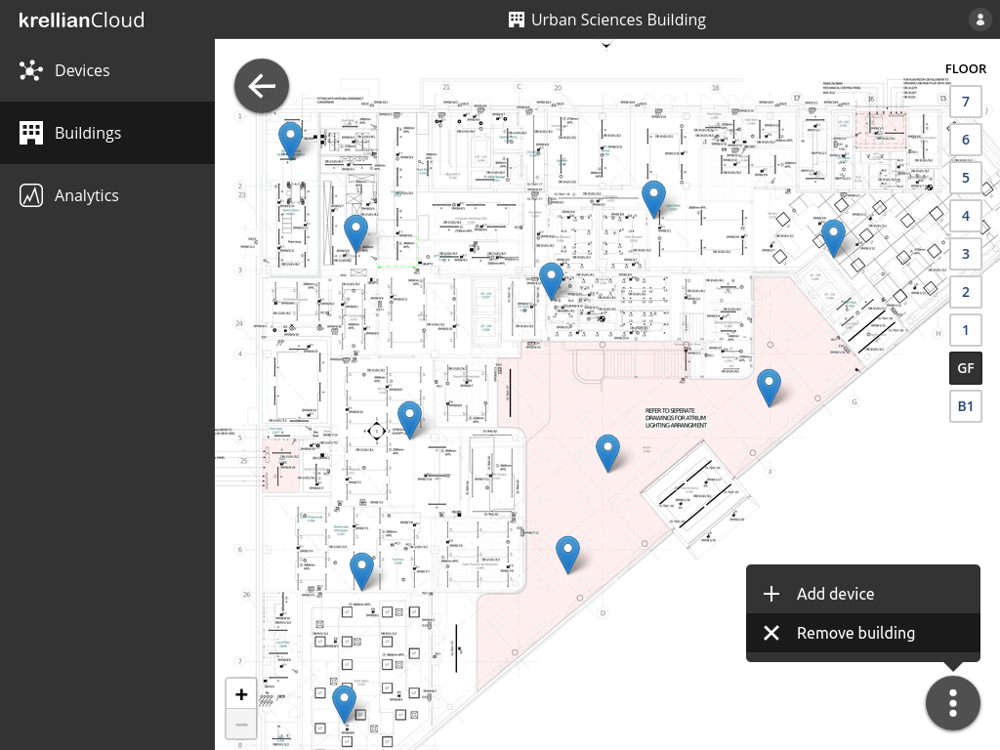
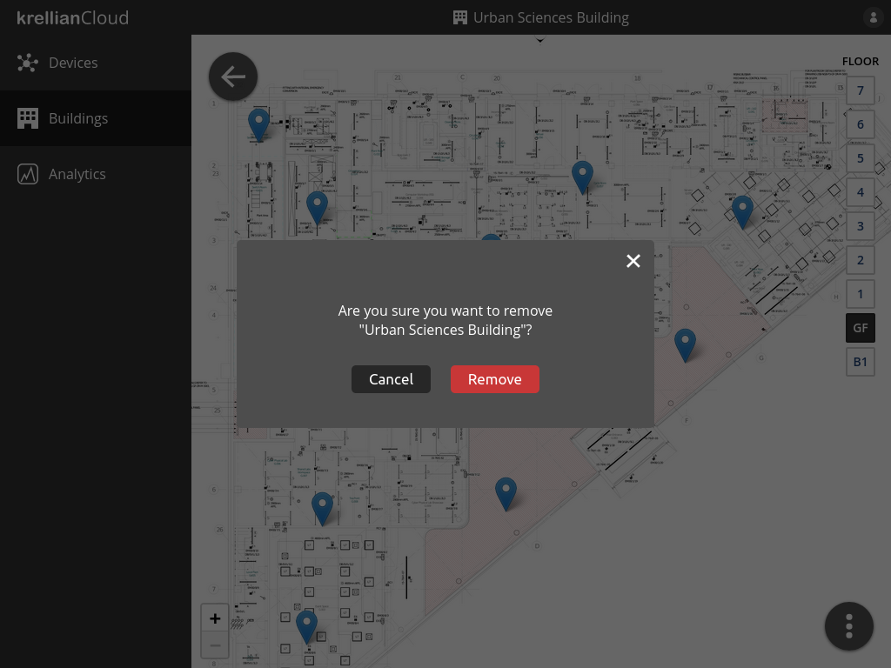

# Remove Building

To remove a building:

1. Navigate to the building in the buildings view
2. Click the overflow menu button at the bottom right of the screen
3. Click the "Remove building" menu option
4. Click the "Remove" button in the confirmation dialog

When a building is removed, all of the associated floorplans and device positions are deleted. The devices are *not* removed from the devices dashboard.

*Remove building option in floor overflow menu*

*Remove building confirmation dialog*