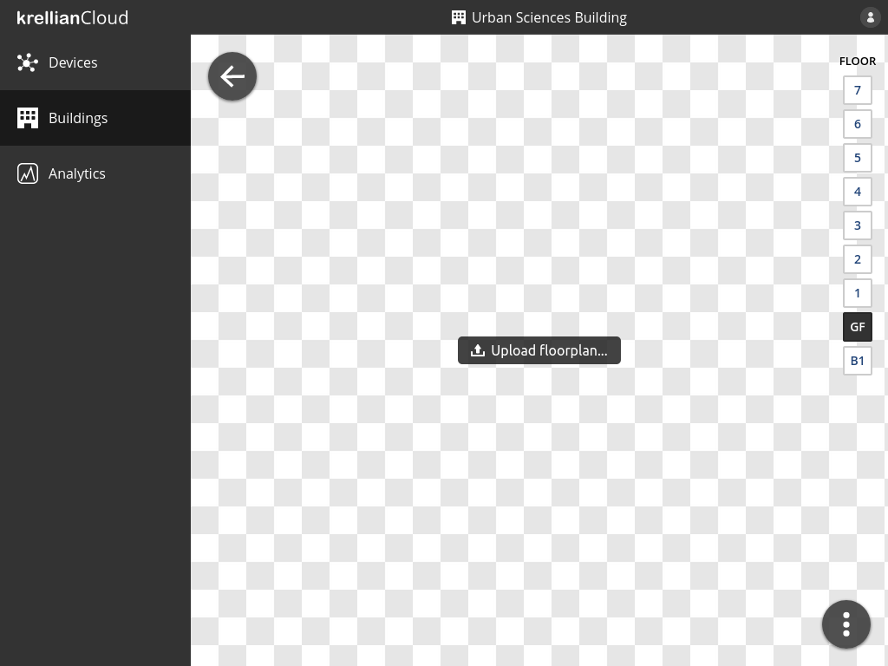
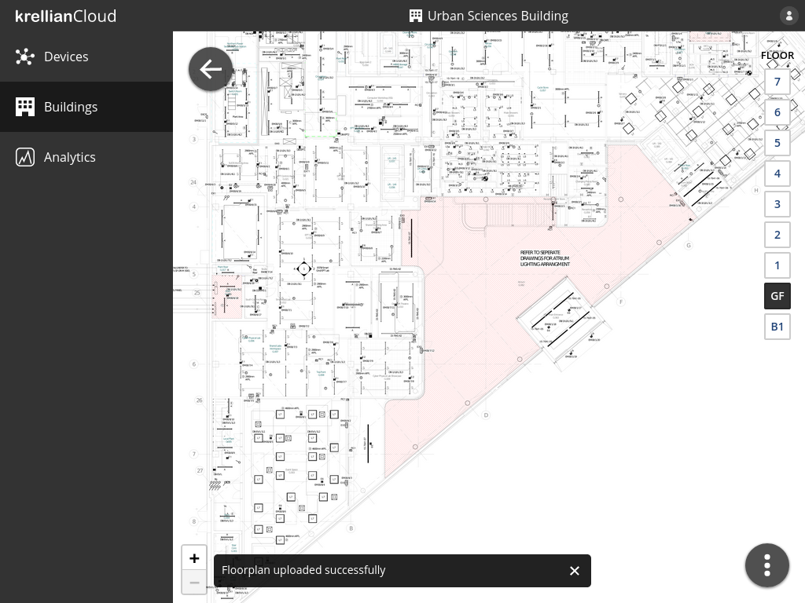

# Upload Floorplan

To upload a floorplan of a floor of a building:

1. Navigate to the detail view of the building from the buildings view
2. Navigate to the floor for which you would like to upload a floorplan using the floor switcher on the right hand side of the screen
3. Click the "Upload floorplan" button
4. Select an image file to upload

Once a floorplan is uploadedn successfully the user can pan and zoom around the floorplan using a mouse or touch gestures, or zoom by pressing the zoom in and out buttons at the bottom left of the floorplan.

*Upload floorplan button*

*Floorplan uploaded confirmation*

