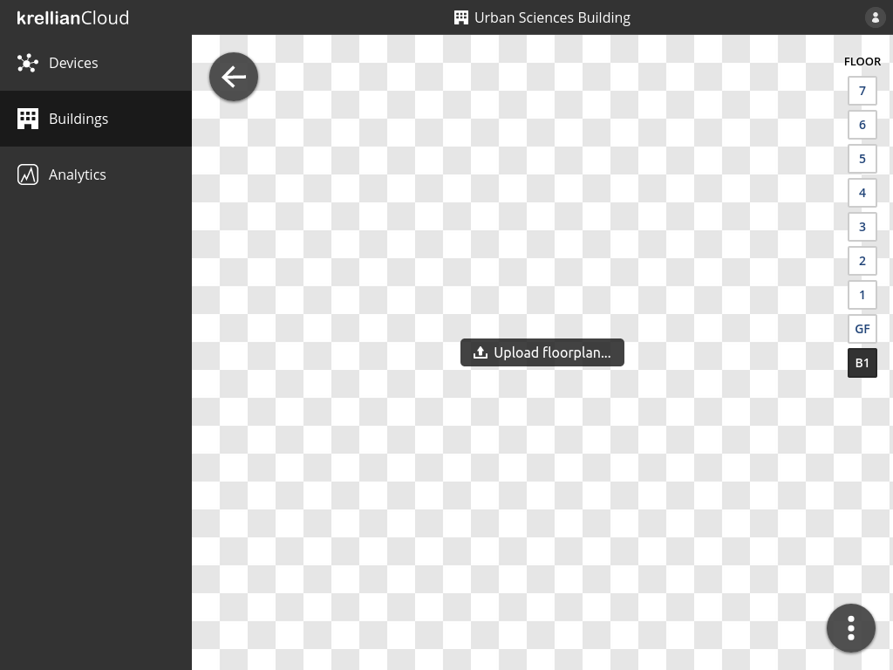

# View Building

To view the details of a particular building:

1. Navigate to the "Buildings" view in the main menu
2. Click on the building you would like to view

To switch between floors the user can click the floor code on the floor switcher on the right hand side of the screen.

*Building view*