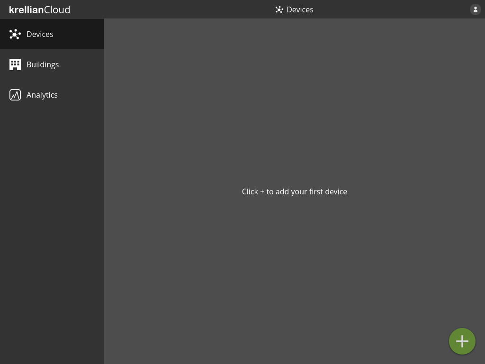
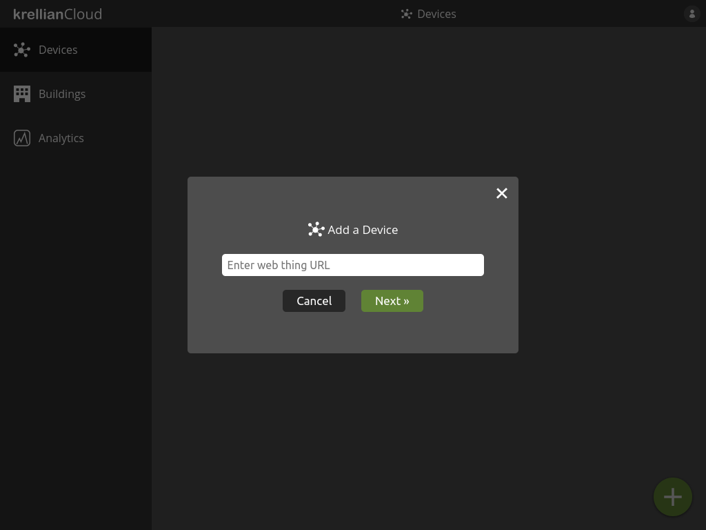
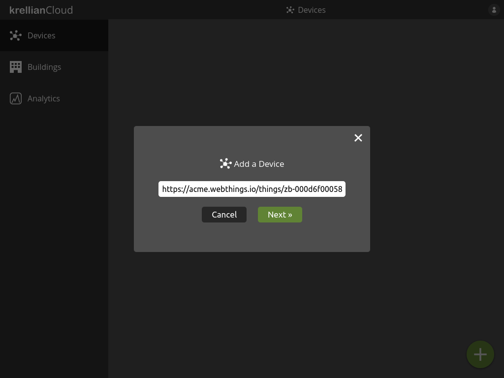
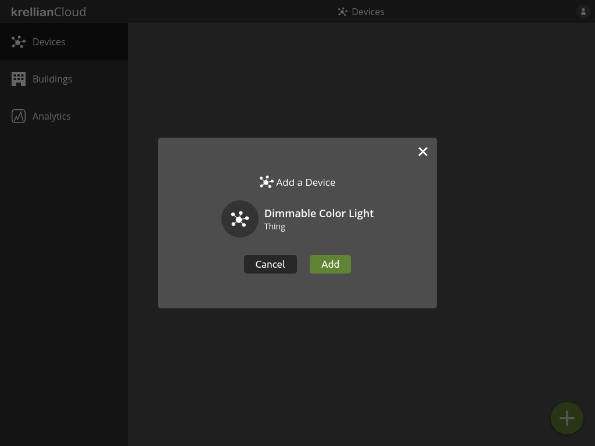
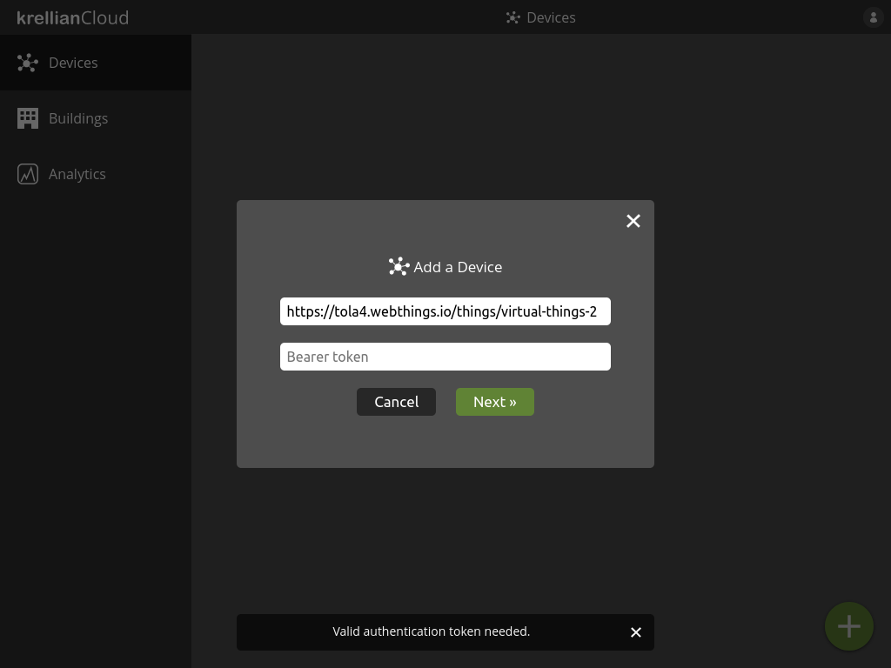
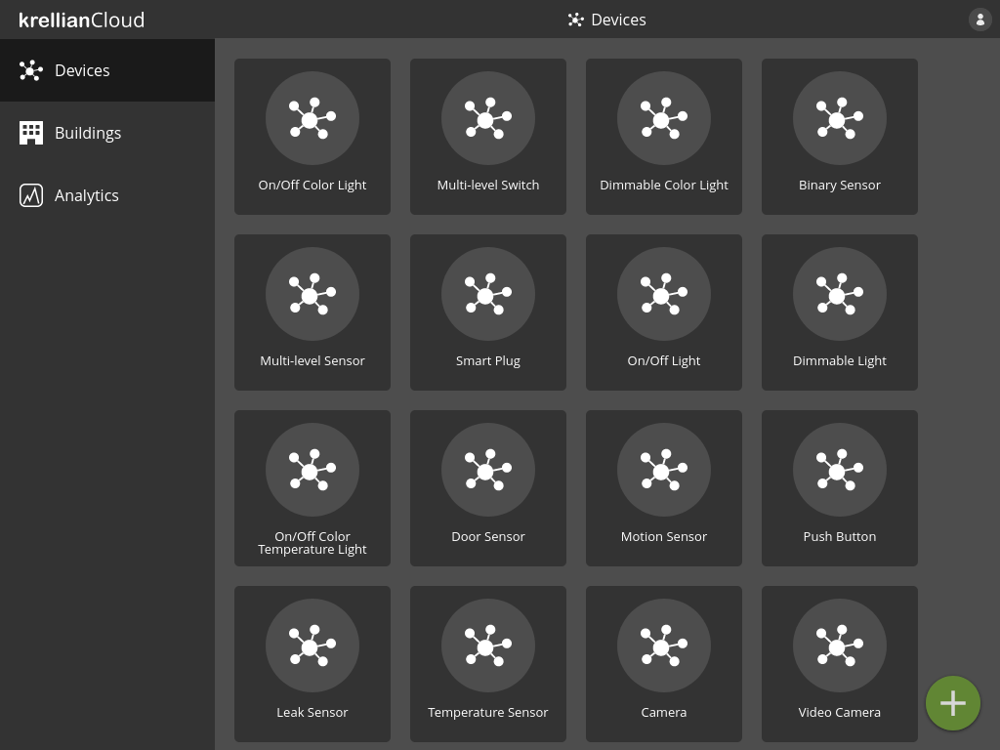
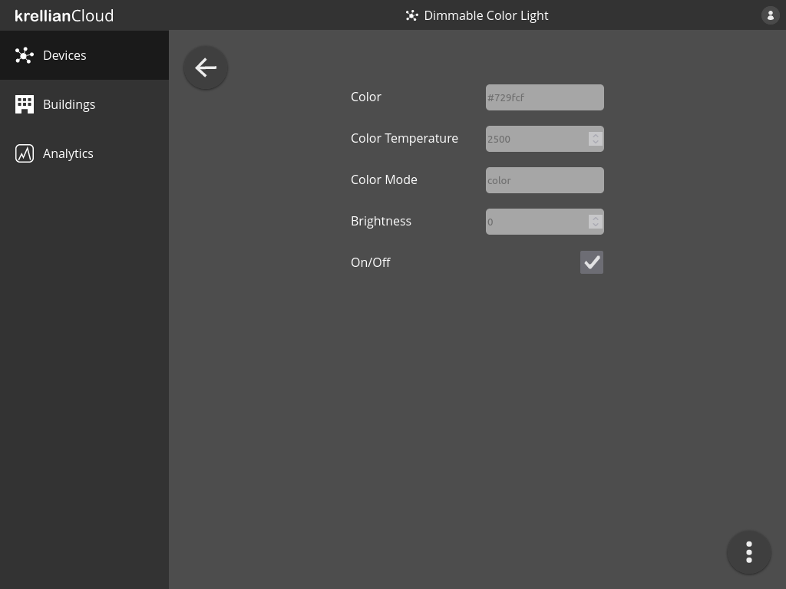
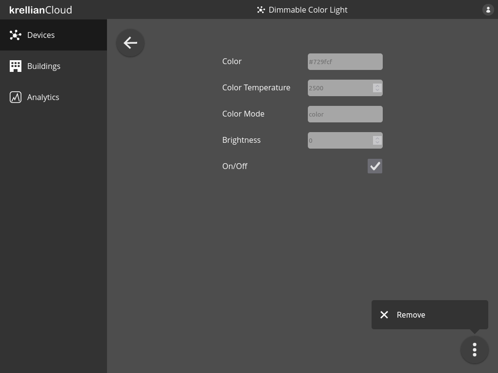
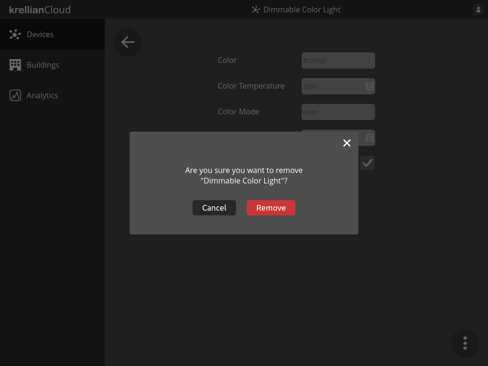

# Devices

## Add Device

Connected devices in a building are represented by "web things", which are expected to follow [W3C Web of Things](https://www.w3.org/WoT/) standards.

To add a device to the device dashboard:

1. Navigate to the "Devices" view in the main menu
2. Click the "+" button at the bottom right of the screen
3. Enter the URL of a [WoT Thing Description](https://www.w3.org/TR/wot-thing-description11/)
4. Click the "Next" button

*Empty devices view*

*Add device dialog*

*Web thing URL entered into add device dialog*

If the Thing Description is retrieved successfully, the user will be shown a preview including the device name and type.

1. Click the "Add" button to add the device

The user will then be taken to the devices view and the new device will be included in the list of devices.

*Device preview*

> **_Technical Note:_** Krellian Cloud currently only supports Thing Descriptions which are served over HTTPS and are either unauthenticated or use HTTP Bearer authentication (see below).

### Authenticate Access to a Device

If a Thing Description is protected by [HTTP Bearer authentication](https://datatracker.ietf.org/doc/html/rfc6750) then the user will be prompted to enter a Bearer token to authenticate access. 

1. Enter a Bearer token and click "Next"

*Bearer authentication prompt*

## List Devices

To list devices on the device dashboard:

1. Navigate to the "Devices" view in the main menu

The user is shown a list of the devices they have added.

*Devices screen*

## View Device

To view details of a particular device:

1. Navigate to the "Devices" view in the main menu
2. Click on the device you would like to view

The user will be shown all of the properties of the device and their current values.

*Device view*

> **_Note:_** A page reload is currently needed to update the value of a property when it changes.

> **_Technical Note:_** Krellian Cloud currently only supports properties with a type of `boolean`, `integer`, `number` or `string`. Web things are expected to provide a [`readallproperties`](https://w3c.github.io/wot-profile/#http-basic-profile-protocol-binding-readallproperties) operation conforming to the [HTTP Basic Profile](https://w3c.github.io/wot-profile/#http-basic-profile). The properties endpoint may use HTTP Bearer authentication, but only if the thing description of the web thing used the same Bearer token during [security bootstrapping](https://www.w3.org/TR/wot-discovery/#exploration-secboot).

## Remove Device

To remove a device from the device dashboard:

1. From a device detail view, click the overflow menu in the bottom right of the screen
2. Click the "Remove" option from the overflow menu
3. Click the "Remove" button on the confirmation dialog to confirm the removal of the device

*Overflow menu on device view*

*Remove device confirmation dialog*