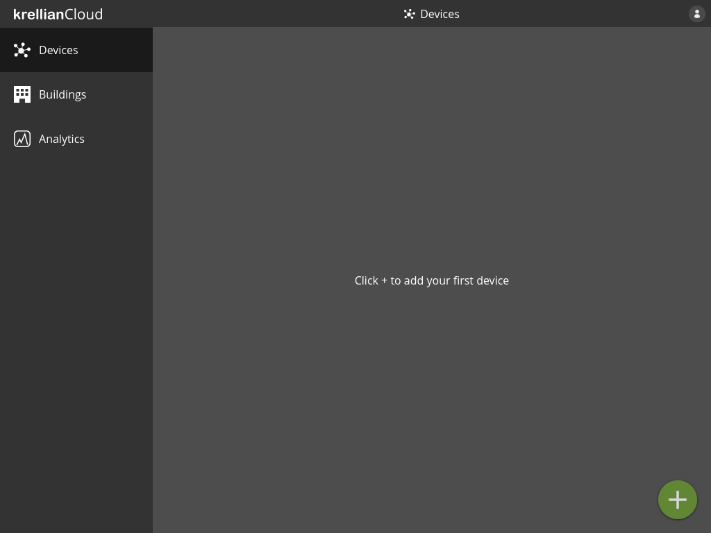
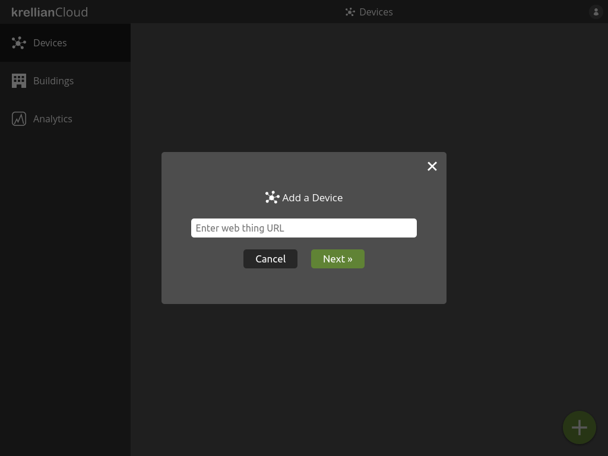
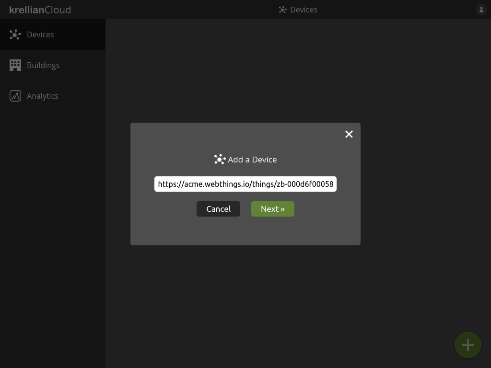
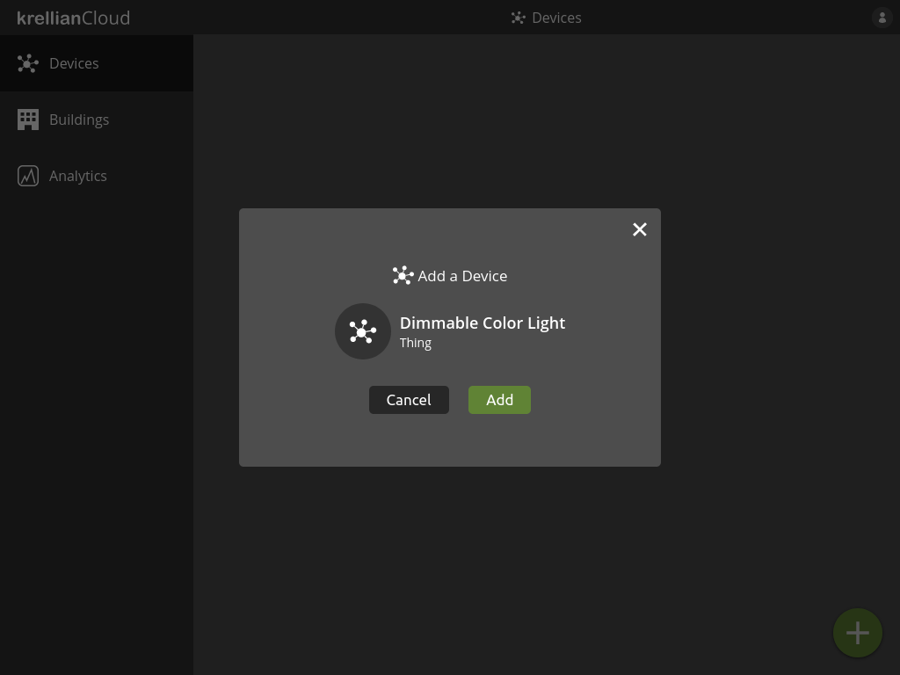
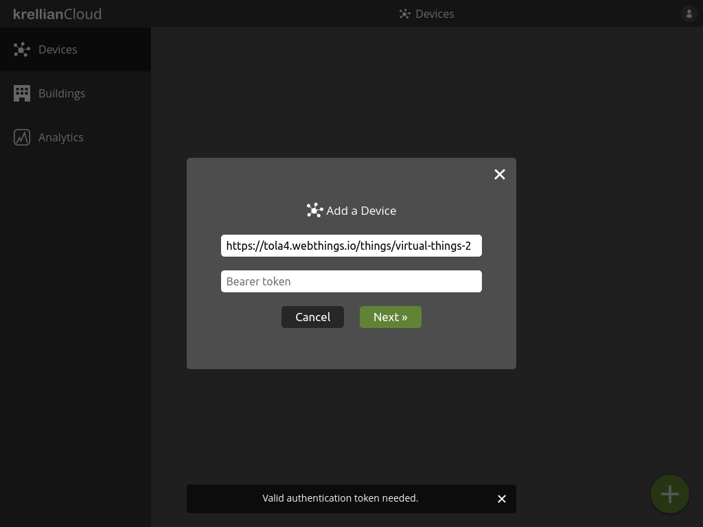

# Add Device

Connected devices in a building are represented by "web things", which are expected to follow [W3C Web of Things](https://www.w3.org/WoT/) standards.

To add a device to the device dashboard:

1. Navigate to the "Devices" view in the main menu
2. Click the "+" button at the bottom right of the screen
3. Enter the URL of a [WoT Thing Description](https://www.w3.org/TR/wot-thing-description11/)
4. Click the "Next" button

*Empty devices view*

*Add device dialog*

*Web thing URL entered into add device dialog*

If the Thing Description is retrieved successfully, the user will be shown a preview including the device name and type.

1. Click the "Add" button to add the device

The user will then be taken to the devices view and the new device will be included in the list of devices.

*Device preview*

> **_Technical Note:_** Krellian Cloud currently only supports Thing Descriptions which are served over HTTPS and are either unauthenticated or use HTTP Bearer authentication (see below).

## Authenticate Access to a Device

If a Thing Description is protected by [HTTP Bearer authentication](https://datatracker.ietf.org/doc/html/rfc6750) then the user will be prompted to enter a Bearer token to authenticate access. 

1. Enter a Bearer token and click "Next"

*Bearer authentication prompt*
