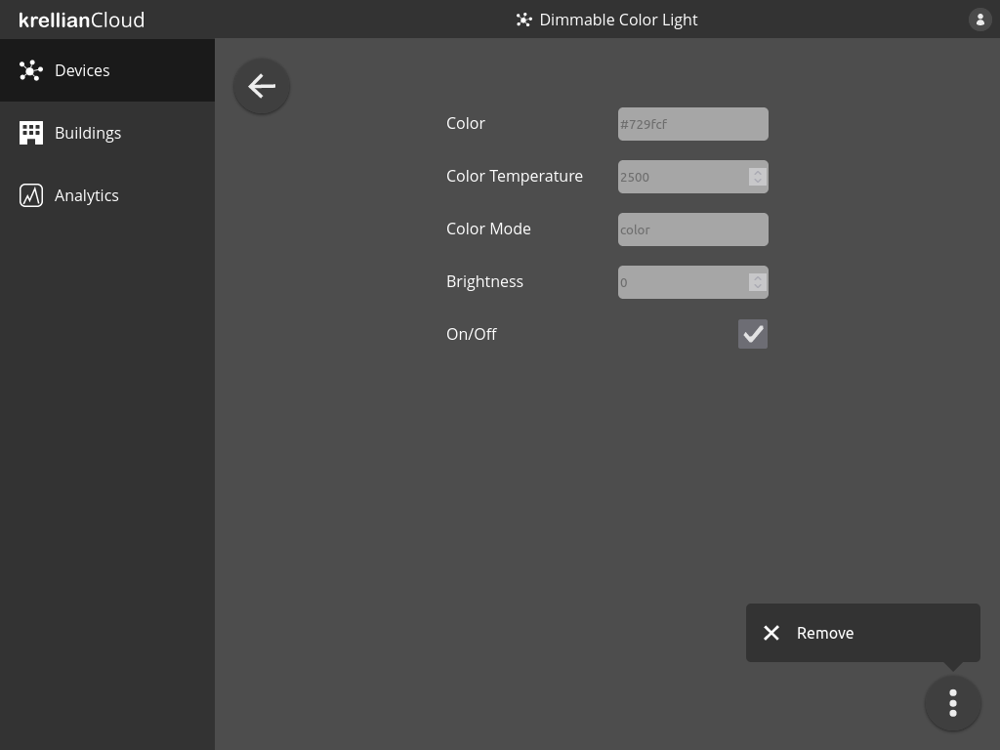
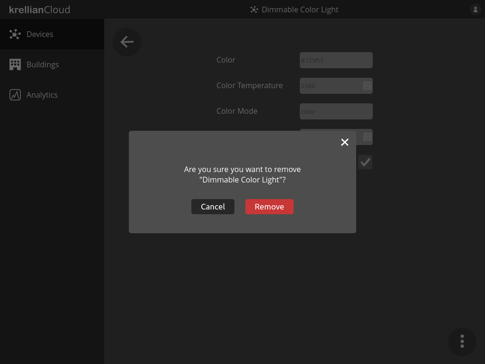

# Remove Device

To remove a device from the device dashboard:

1. From a device detail view, click the overflow menu in the bottom right of the screen
2. Click the "Remove" option from the overflow menu
3. Click the "Remove" button on the confirmation dialog to confirm the removal of the device

*Overflow menu on device view*

*Remove device confirmation dialog*