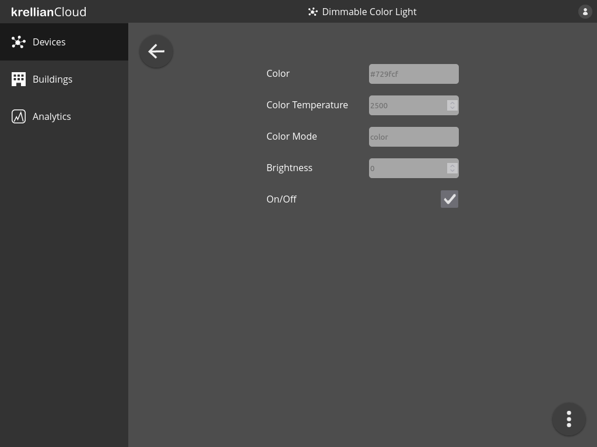

# View Device

To view details of a particular device:

1. Navigate to the "Devices" view in the main menu
2. Click on the device you would like to view

The user will be shown all of the properties of the device and their current values.

*Device view*

> **_Note:_** A page reload is currently needed to update the value of a property when it changes.

> **_Technical Note:_** Krellian Cloud currently only supports properties with a type of `boolean`, `integer`, `number` or `string`. Web things are expected to provide a [`readallproperties`](https://w3c.github.io/wot-profile/#http-basic-profile-protocol-binding-readallproperties) operation conforming to the [HTTP Basic Profile](https://w3c.github.io/wot-profile/#http-basic-profile). The properties endpoint may use HTTP Bearer authentication, but only if the thing description of the web thing used the same Bearer token during [security bootstrapping](https://www.w3.org/TR/wot-discovery/#exploration-secboot).