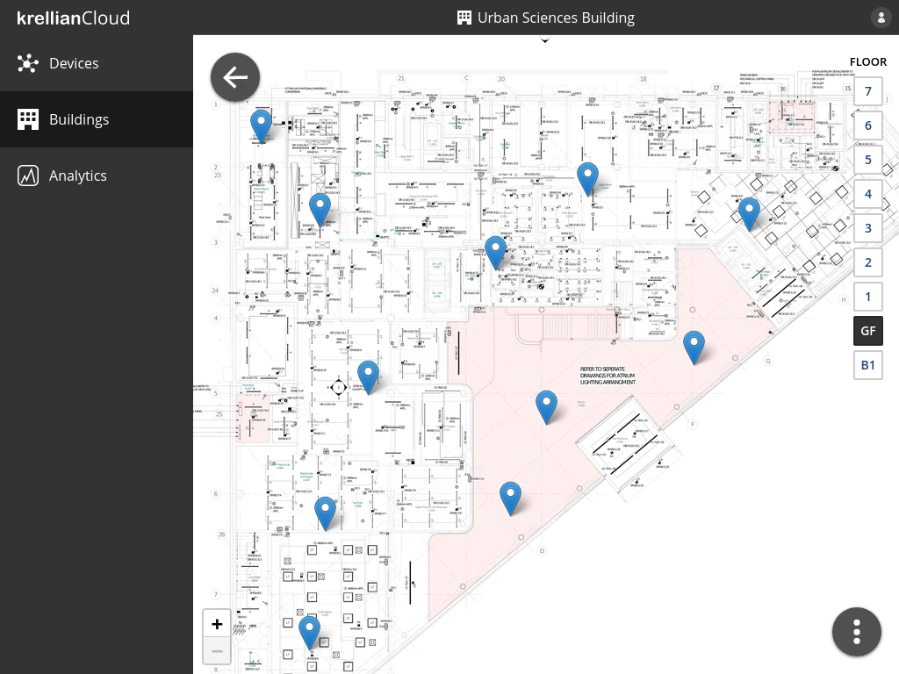

# Krellian Cloud

[Krellian Cloud](https://krellian.com/cloud/) is a cloud service which
provides real-time data analytics for buildings. It can create a digital twin of a building to model how it is being used and help identify potential optimisations.

Krellian Cloud is intended to be used in conjunction with a Web of Things gateway such as [Krellian Hub](https://krellian.com/products/hub/), or the open source [WebThings Gateway](https://webthings.io/gateway/) software application, which exposes all of the connected devices in a building as "web things", following [W3C Web of Things standards](https://www.w3.org/WoT/).
