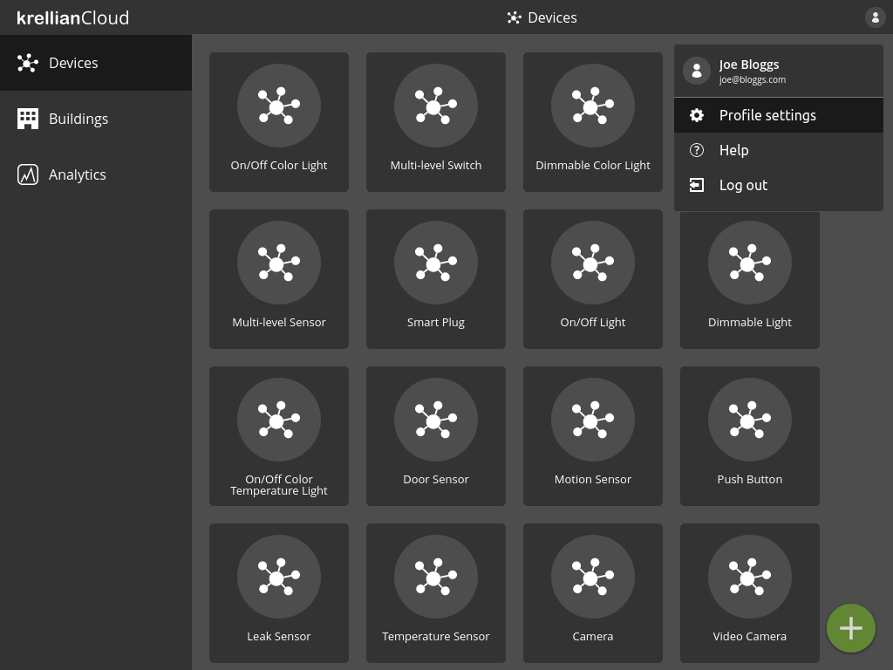
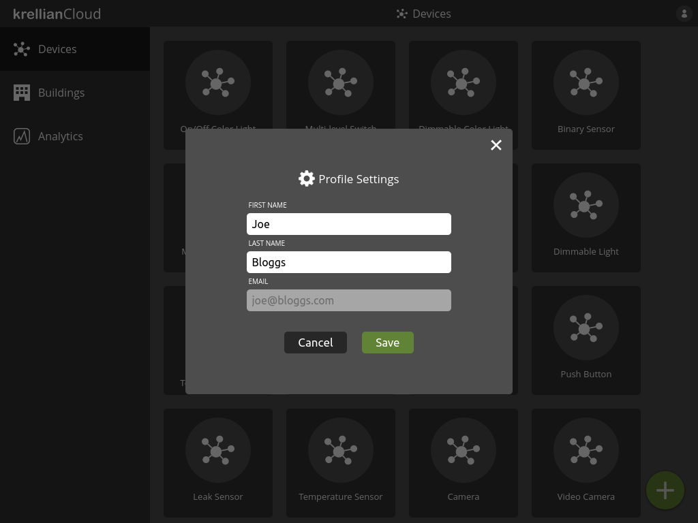

# Edit Profile

To edit your profile settings:

1. Click on the profile menu icon at the top right of the screen
2. Click the "Profile settings" option
3. Edit the desired fields
4. Click "Save"

> **_Note:_** Currently only the user's first name and last name can be edited. Email address can not be edited.

*Profile settings option in profile menu*

*Profile settings dialog*