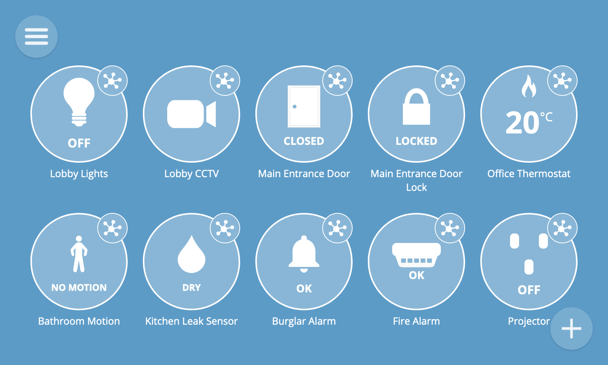

# Krellian Hub

[Krellian Hub](https://krellian.com/hub/) is a commercial smart building hub for securely monitoring and controlling a building over the internet. It can consolidate multi-vendor building management systems into a single standardised interface.

It is an edge IoT gateway intended primarily for use in commercial buildings and bridges a range of different IoT protocols to a standards-based web API using the <a href="https://w3.org/WoT">Web of Things</a>. The hub is rugged industrial-grade hardware designed for 24/7 operation, even during internet outages. It receives automatic over-the-air software updates and has a containerised security model for complete peace of mind.

 - Durable fanless metal case
 - Fast Ethernet networking
 - Versatile Wi-Fi & Bluetooth connectivity
 - Reliable SSD storage
 - Energy efficient Intel® Atom™ processor
 - Extensible via USB

The hub provides a web interface for monitoring and controlling devices, configuring hub settings, and automating a building using an intuitive drag-and-drop rules engine. It also has an extensible add-ons system to add support for a wide range of off-the-shelf devices and protocols.

 
 *Krellian Hub web interface*

Krellian Hub is powered by **Krellian OS**, the smart building operating system.

---

**🗒️ Note:** Krellian Hub is a fully integrated commercial product built on industrial-grade hardware and a production quality embedded operating system with an immutable filesystem and container-based security. It is built on open source software and open standards. If you would like to host a Web of Things gateway on your own hardware then we recommend the community version of Krellian Hub's software called [WebThings Gateway](https://webthings.io/gateway/) which you can run on your own operating system. WebThings Gateway has many of the same features as Krellian Hub but does not benefit from automatic over-the-air updates, containerised security or commercial support.