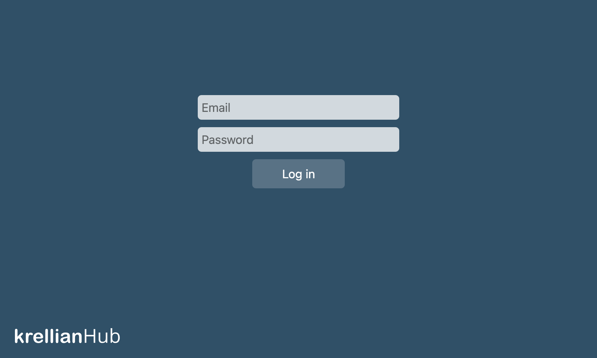

# Log In

To log into the hub from a new device, navigate to "http://localhost:8080" (from the same machine), "http://{local IP address}" if on the same network, or by using your unique subdomain (e.g. "https://foo.krellian.net"), and enter your email address and password.

