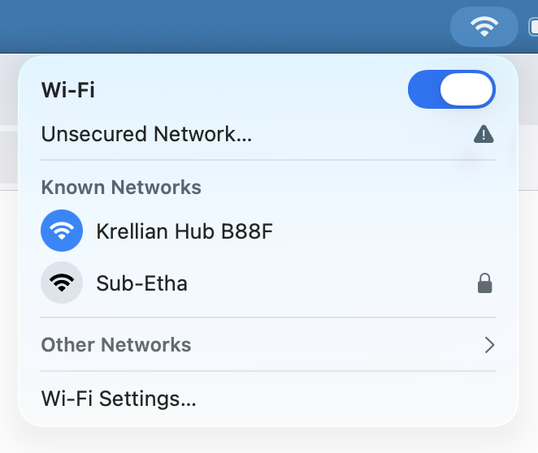
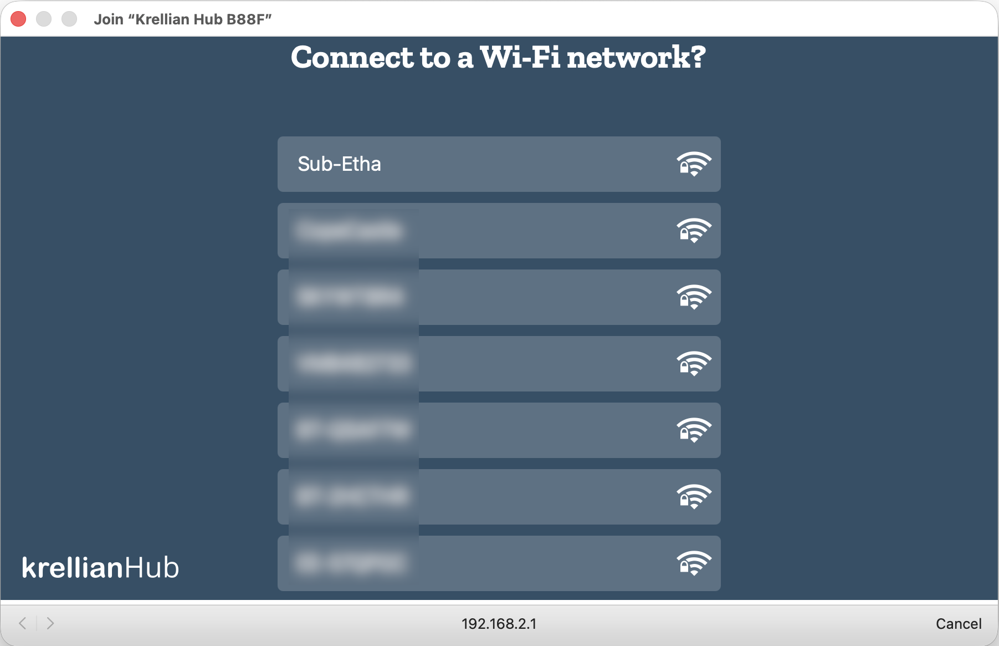
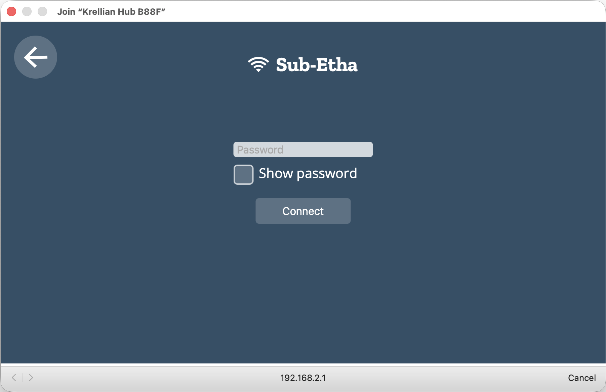
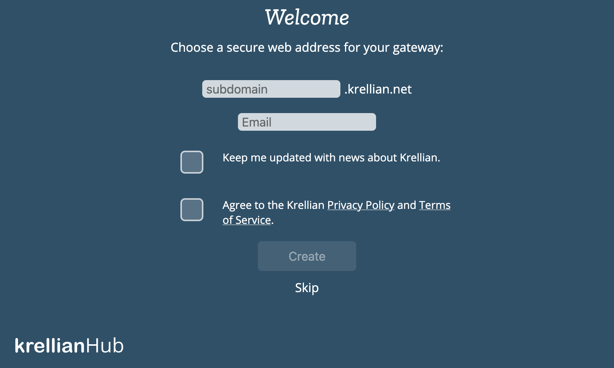
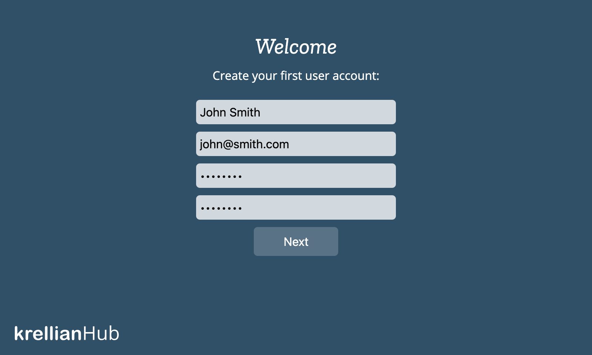

# First Time Setup

## Connect to a Network

When Krellian Hub first boots up it will check to see whether it is plugged into a wired network and can get a network connection via an automatically assigned IP address.

If your hub is connected to a wired network connection (which we recommend) then you can skip to the [Register a Subdomain](#register-a-subdomain) section below.

If the hub can not detect an active network connection then it will create a Wi-Fi hotspot called **"Krellian Hub XXXX"** (where XXXX are four digits from the hub's MAC address).

You can use a smartphone, tablet or desktop computer to scan for and connect to that Wi-Fi network.

Once your device is connected to the Wi-Fi hotspot a "captive portal" page should automatically appear, showing a list of nearby Wi-Fi networks.

Select the desired network and if you are prompted for a password then enter the Wi-Fi password and click "Connect". 

The "Connecting to Wi-Fi..." page should then automatically disappear as the Wi-Fi hotspot is turned off and you are re-connected to your usual Wi-Fi network.

Alternatively, to skip connecting to a Wi-Fi network (if already connected via Ethernet), click the "Skip" button (you can reconfigure Wi-Fi later from [Settings](settings.md)).

After you've connected your hub to a wireless network, you should ensure that your smartphone, tablet or desktop computer is connected to the same Wi-Fi network and then navigate to [http://gateway.local](http://gateway.local) in your web browser to access the hub's web interface.

**🗒️ Notes:** 

* If you are connected to the "Krellian Hub XXXX" Wi-Fi network but you don't see the captive portal, you can try typing "http://192.168.2.1" into your web browser's address bar to manually navigate to the page.
* If you're not able to access "http://gateway.local", you may need to look up the IP address assigned to the hub by your router (look for a hostname of “gateway”), and type that into the address bar of your web browser instead.
- If neither "http://gateway.local" or "http://{IP ADDRESS}" will load in your browser, check to make sure your computer is definitely connected to the same network you connected the hub to.
- If you move the hub to another location and it can no longer access your building network, it will revert to access point mode so you can connect to it and re-configure a different network.

## Register a Subdomain

Once you've successfully loaded the hub's web interface you will be offered the option to register a unique subdomain to safely access your hub over the Internet using a secure tunnelling service.

  

Enter your choice of subdomain and an email address in case you need to retrieve your subdomain later on a new hub. You will also need to agree to the Krellian Privacy Policy and Terms of Service in order to use the tunnelling service and over-the-air update service provided by Krellian. Click “Create” and wait a few moments for the subdomain registration to complete. You should then be redirected to your new subdomain.

**🗒️ Notes:**

- You can choose to skip this step (either to only use the hub locally on your building's network or manually configure DNS yourself), but note that currently if you do skip this step a factory reset will be required in order to register a subdomain.
- If you have previously registered a subdomain you want to re-use, enter the subdomain and the email address you used to register it and follow the on-screen instructions to re-claim it.

## Create a User Account

The hub will next prompt you to create your first user account. Enter a name, email address and a password and click "Next".

**🗒️ Note:** You can create additional user accounts later.

**Success!**

Once your user account has been successfully created, you will be automatically logged in to the hub and you should see an empty "Things" screen, ready for you to start adding devices.

