# Things

On Krellian Hub, connected devices are referred to as "things".

**🗒️ Note:** Before adding your first "thing" you may want to install an adapter [add-on](../settings/#add-ons) for the protocol or platform the device is using (e.g. Zigbee, Z-Wave or HomeKit).

## Add Thing

To add a thing to your hub, click the "+" button on the Things screen. This will tell the hub to start scanning for new devices.

**🗒️ Note:** Many devices will require the user to press a pairing button of some kind in order to initiate a pairing mode. You should follow any instructions that came with your device to enable pairing mode before clicking the "+" button.

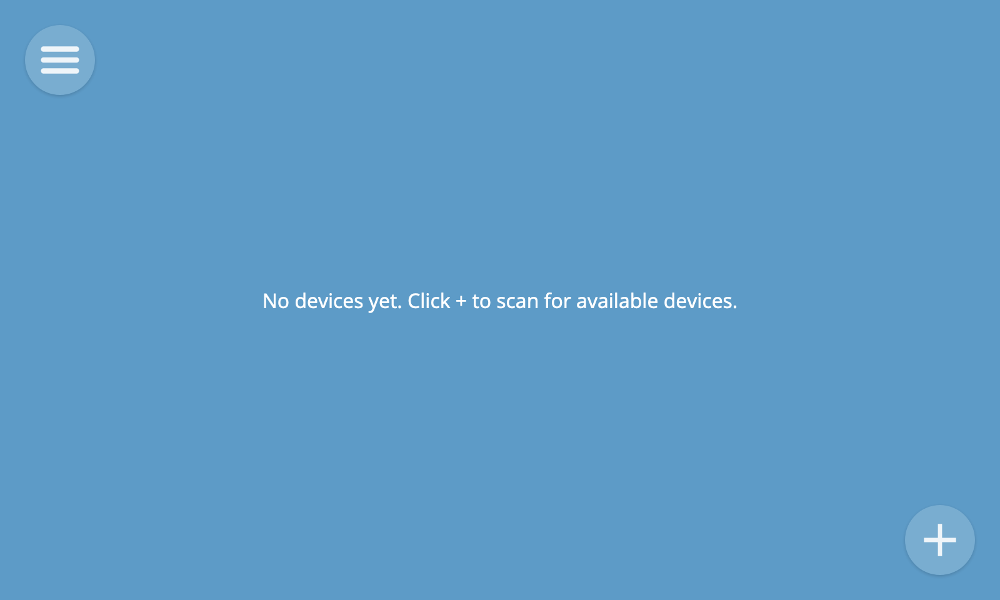

A preview of any discovered devices will appear on the screen.

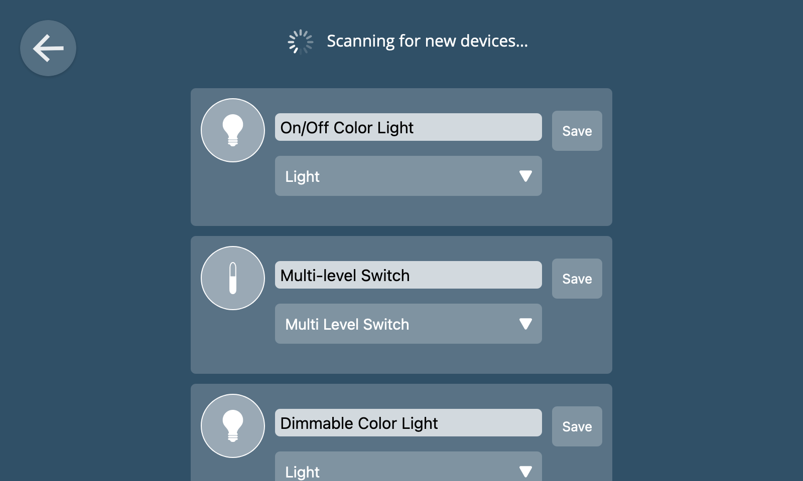

When a device has multiple capabilities (e.g. it acts as both an on/off switch and an energy monitor) you can choose the primary function to display in the user interface from a drop-down menu.

You can also change the name of the device to something meaningful to you (e.g. "Lobby Light") before clicking "Save" to add it to the hub.

If you click the back button at the top left of the screen to go back to the Things screen, you should now see an icon representing the device you added.

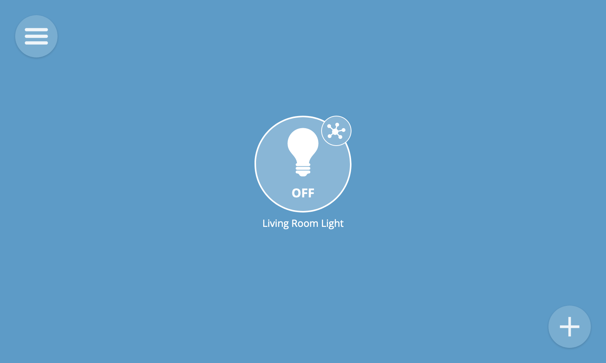

## View Things

To view all of your things, select the "Things" option from the main menu.

Each thing is represented by an icon. The icon shows a live overview of the current state of the thing (e.g. its on/off state or the current value of a key property). Different styles of icon are used for different types of devices.

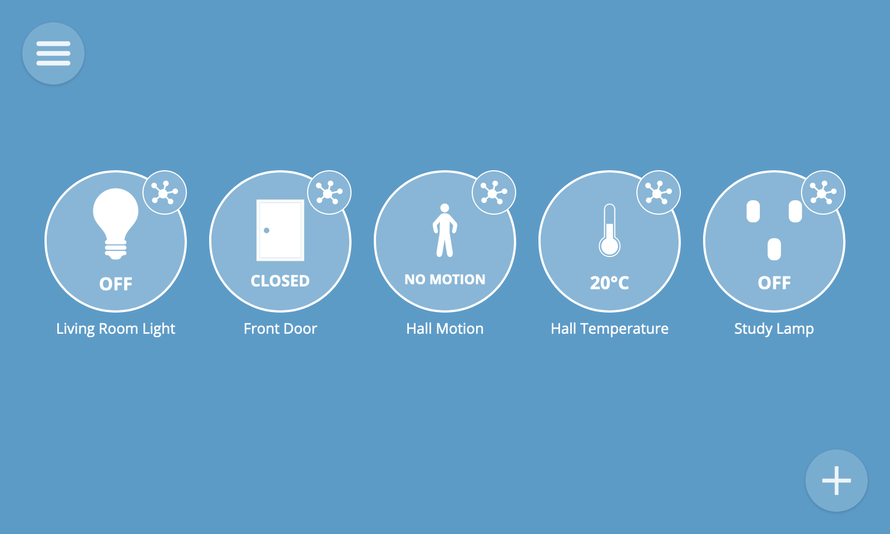

### Thing Detail

To view the properties and actions of a thing, click on the small round detail button at the top right of a thing icon. This will navigate to its detail view.

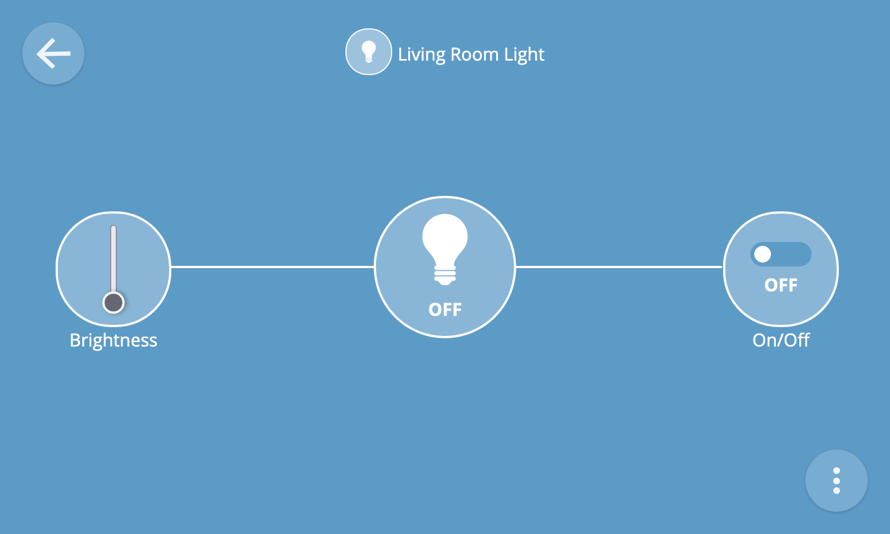

The detail view will show you all of the properties and actions associated with a device.

#### Properties

Properties may be read-only (e.g. a temperature reading) or writable (e.g. an on/off state which can be toggled with a switch, or a level which can be set with a slider).

There are many different types of properties for different types of devices, which each have a specialised user interface.

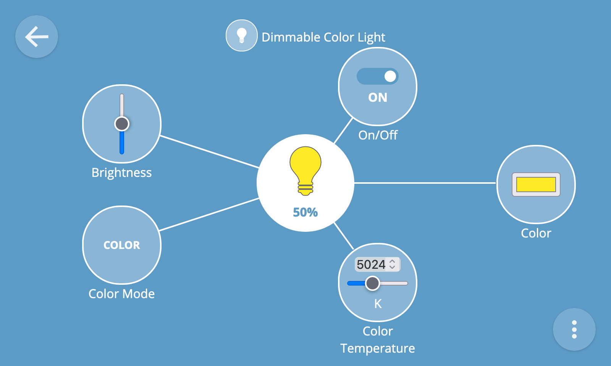

#### Actions

Actions are represented by a button and may accept one or more input values (e.g. a percentage to fade a light to over a specified number of seconds).

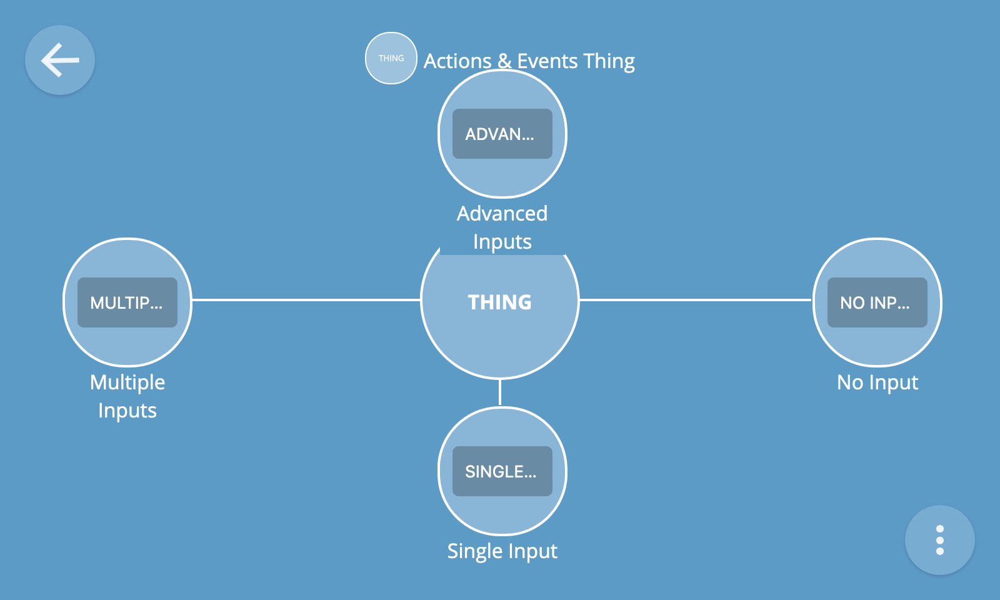

To provide inputs to an action, click the action's button on the thing detail view and complete the fields in the form which appears before pressing the submit button.

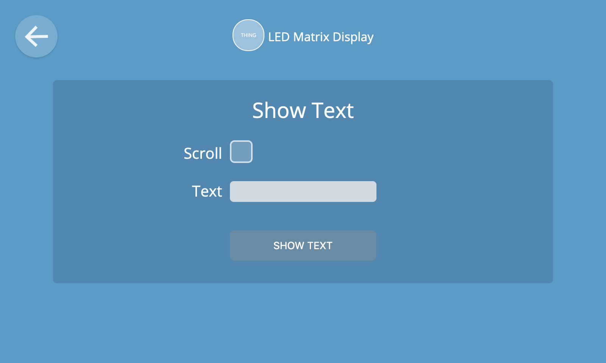

If an action doesn't require any inputs then pressing its button will immediately invoke the action.

#### Events

To view a log of events emitted by a thing, click the overflow menu button at the bottom right of the screen and select the "Event log" option.

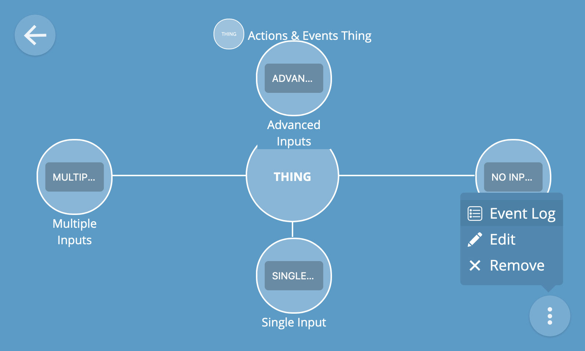

You will then be shown a live log of events being emitted by the device, including event data and timestamps.

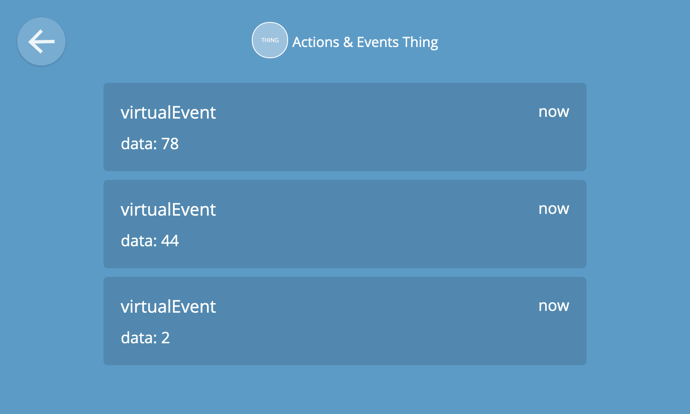

**🔧 Technical note**: The hub's adapter [add-ons](../settings#add-ons) are responsible for mapping various devices and protocols to an extensible set of "[WoT capability schemas](https://webthings.io/schemas/)". These schemas are represented in a machine-readable format via semantic annotations on a Thing Description. Thing Descriptions are then used by the hub to generate a rich user interface for each type of device capability, property, action and event.

## Edit Thing

To edit a thing, select the "Edit" option from the thing detail overflow menu at the bottom right of the screen.

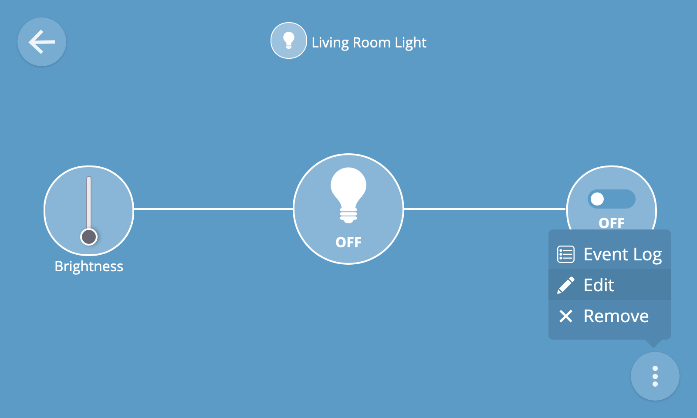

You can then edit the name of the thing and/or its primary device type before clicking "Save" to save your changes.

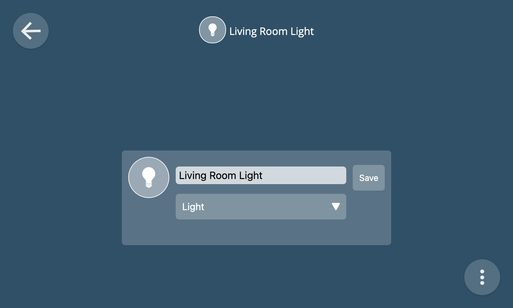

## Remove Thing

To remove a thing, select the "Remove" option from the thing detail overflow menu at the bottom right of the screen.

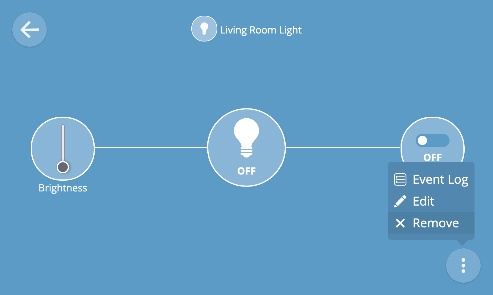

You will then be asked to confirm the removal of the device from the hub.

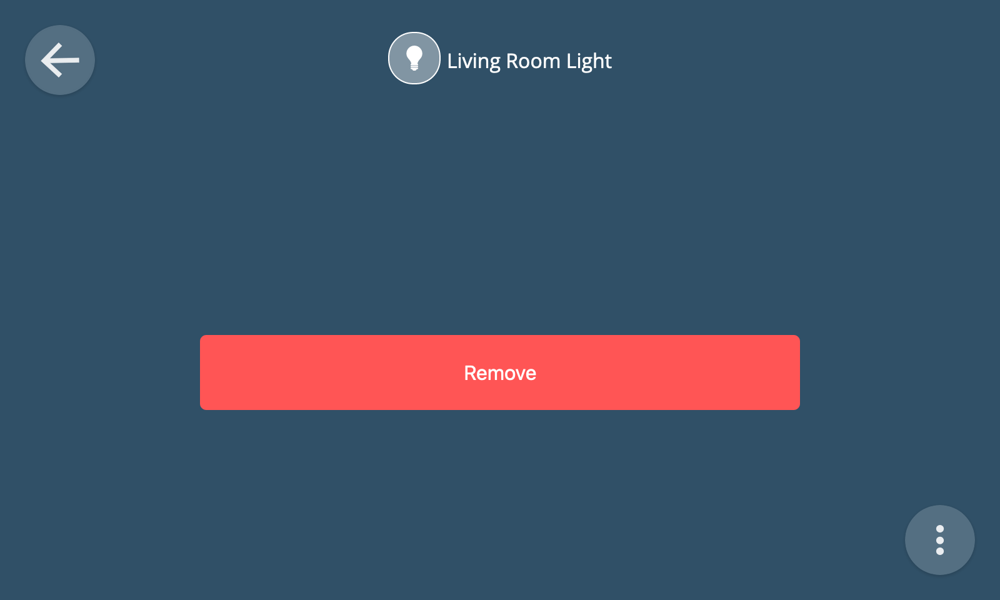

**🗒️ Note:** Whilst removing a device from the hub using the remove thing feature will remove it from the hub user interface, it might not always fully un-pair it from the hub at the hardware level (e.g. if using a USB dongle). Sometimes a device will have an un-pairing procedure which needs to be followed in order to full disassociate it from the hub (e.g. involving pressing a button on the device).

## Groups

It is possible to organise Things into groups. You can create a group by clicking the big "+" button at the bottom right of the Things screen and then clicking "Add group".

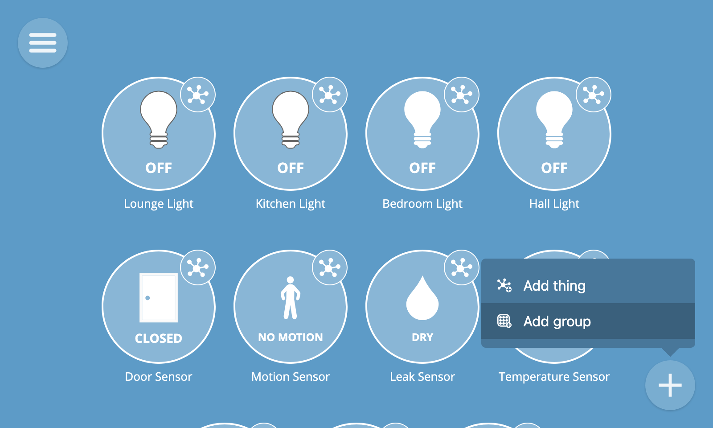

You can then drag and drop Things into groups and organise them however you like.

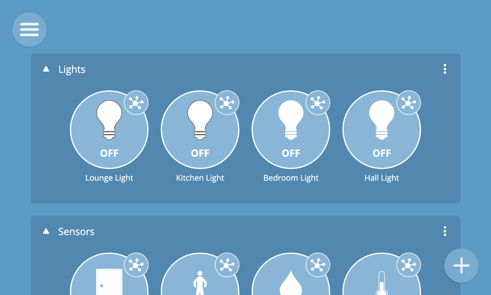

To edit or remove a group click the overlow menu (...) at the top right of the group's box.