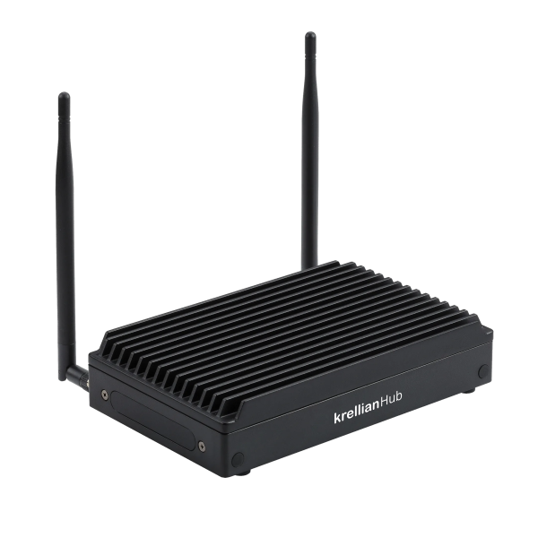

# Krellian Documentation

Welcome to the documentation for [Krellian's](https://krellian.com) products and services.

Krellian helps make buildings smarter, safer and more sustainable with smart
building technology.

## Krellian Hub

[Krellian Hub](hub/introduction.md) is a commercial smart building hub for securely monitoring and controlling a building over the internet.

## Krellian Cloud

[Krellian Cloud](cloud/introduction.md) is a cloud service which
provides real-time data analytics for buildings.

