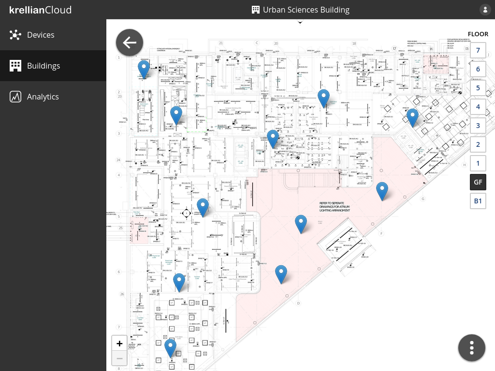

# Krellian Documentation

Welcome to the documentation for [Krellian's](https://krellian.com) products and services.

Krellian helps make buildings smarter, safer and more sustainable with smart
building technology.

## Krellian Cloud

[Krellian Cloud](https://krellian.com/services/cloud) is a cloud service which
provides real-time data analytics for buildings to model how they're being used and help identify potential optimisations.

Krellian Cloud is intended to be used in conjunction with a Web of Things gateway such as [Krellian Hub](https://krellian.com/products/hub/), or the open source [WebThings Gateway](https://webthings.io/gateway/) software application, which exposes all of the connected devices in a building as "web things", following [W3C Web of Things standards](https://www.w3.org/WoT/).

*Devices plotted on a floor plan of a building*

